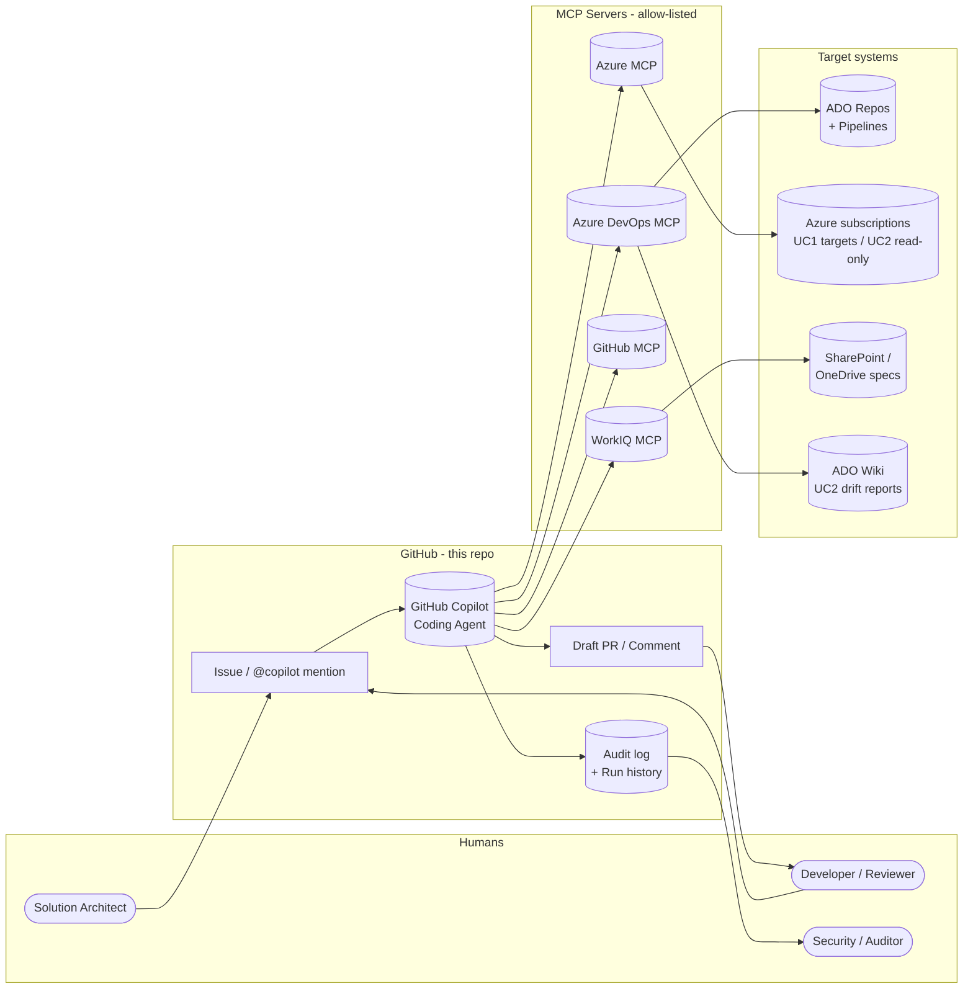

# Architecture

| Field | Value |
|-------|-------|
| **Version** | 2.0.0 |
| **Date** | 2026-05-18 |
| **Author** | Urs Rüegg |
| **Status** | Draft |
| **Previous Version** | 1.0.0 (Python/Container-Apps runtime stubs); 2.0.0 rewritten around the **GitHub Copilot coding agent runtime** per [ADR-0002](adr/0002-runtime-is-github-copilot-coding-agent.md). |

> **Related**: [SOLUTION_OVERVIEW.md](SOLUTION_OVERVIEW.md) for the narrative
> design and use cases; [ADR-0002](adr/0002-runtime-is-github-copilot-coding-agent.md)
> for the runtime decision; [INFRASTRUCTURE.md](INFRASTRUCTURE.md) for the
> distinction between platform infrastructure (none) and UC1 output
> infrastructure (Bicep templates the agent produces).

## Table of Contents

1. [System Context](#1-system-context)
2. [Container / Component View](#2-container--component-view)
3. [Agent Contracts](#3-agent-contracts)
4. [Tool Contracts (MCP)](#4-tool-contracts-mcp)
5. [Data Flow](#5-data-flow)
6. [Trigger Mechanics](#6-trigger-mechanics)
7. [Non-Functional Considerations](#7-non-functional-considerations)
8. [Open Questions](#8-open-questions)
9. [References](#9-references)

## 1. System Context

The platform is a GitHub repository containing **agent definitions** (Markdown
prompt files), **MCP server allow-list** (JSON), **Bicep template library**
(UC1 outputs), and **golden-task fixtures** (Markdown). All agent execution
happens inside **GitHub Copilot coding agent**, which is invoked by issues,
`@copilot` mentions, or `workflow_dispatch`. Agent outputs are pull requests,
issue comments, and committed files.



**Trust boundaries**:
- Repo ↔ GitHub Copilot coding agent: GitHub-managed identity and audit.
- Copilot ↔ MCP servers: each MCP server presents a typed tool surface; allow-list is `.github/copilot/mcp.json`.
- MCP servers ↔ Azure / ADO / M365: federated credentials or OBO tokens; no long-lived secrets.

## 2. Container / Component View

The "containers" are repository assets, not hosted services. The agent itself runs inside GitHub-managed compute.

| Component | Asset Type | Location | Purpose |
|-----------|------------|----------|---------|
| **`AGENTS.md`** *(planned)* | Markdown | Repo root | Top-level agent registry: identity, owner, trigger, MCP servers, side-effect ceiling, golden-task path. Read on every Copilot run. |
| **`.github/copilot-instructions.md`** | Markdown | This repo | Cross-cutting conventions, PR contracts, SemVer policy. |
| **`.github/copilot/mcp.json`** *(planned)* | JSON | This repo | MCP server allow-list (`azure-mcp`, `azure-devops-mcp`, `github-mcp`, `workiq-mcp`). |
| **`.github/ISSUE_TEMPLATE/uc*.yml`** *(planned)* | YAML | This repo | Issue templates that drive each use case (`uc1-build-subscription.yml`, `uc2-drift-scan.yml`, `uc3-pr-review.yml`). |
| **`.github/workflows/`** *(planned)* | GitHub Actions YAML | This repo | `ci.yml` (markdownlint + link check); `iac-validate.yml` (Bicep build + what-if for UC1 outputs); `uc2-nightly.yml` (schedule → issue); `security.yml`; optional `eval-goldens.yml`. |
| **`agents/<name>/AGENT.md`** *(planned)* | Markdown | This repo | Per-agent prompt file (Identity, Scope, Tools, Refusal Rules, Output Contract, Confirmation Rules). |
| **`agents/<name>/golden-tasks.md`** *(planned)* | Markdown | This repo | Per-agent acceptance fixtures (input issue body + expected MCP calls + expected PR/comment shape + forbidden behaviors). |
| **`infra/`** *(planned, **UC1 output**)* | Bicep | This repo | The landing-zone template library the Spec Parser Agent assembles into PRs against the customer's ADO Repo. **Not** infrastructure that hosts the agent. |
| **`samples/`** *(planned)* | JSON / Markdown | This repo | Sample WorkIQ specs, sample ADO PR payloads, sample drift reports — used as fixtures in golden tasks. |
| **GitHub Copilot coding agent** | Hosted service | github.com | The runtime. Picks up issues, opens branches, runs MCP tools, posts comments and PRs. Audit + run history visible in GitHub UI. |
| **MCP servers** | External services | Microsoft-hosted / community-hosted | Tool surfaces the agent calls via the allow-list. No code in this repo. |

**Scaling and availability** are properties of GitHub Copilot coding agent
and the MCP servers; they are not properties this repo configures.

## 3. Agent Contracts

Each agent is a Markdown prompt file under `agents/<name>/AGENT.md`. The
contract below is the structure every prompt file MUST follow; per-agent
details are filled in during the use-case sprint.

```markdown
# Agent: <agent-name>
## Identity
- Owner: <team or person>
- Trigger: <issue template / @mention / workflow_dispatch / schedule>
- Side-effect ceiling: <read | write | deploy | delete>

## Scope
- In scope: ...
- Out of scope: ...

## Tools (MCP)
- <mcp-server>/<tool-name>: <purpose>
- ...

## Refusal Rules
- Refuse to operate outside the configured target.
- Refuse to fire any deploy/delete tool without an explicit human approval comment.
- Refuse to commit secrets or PII.

## Output Contract
- One draft PR per run, or one PR comment per UC3 review.
- PR description includes: scope, FR/NFR IDs implemented, validation evidence, residual risks.

## Confirmation Rules
- For side-effect ceiling deploy or delete: produce a what-if / plan first; pause until human approval comment with the magic phrase "approved-to-apply"; only then call the mutating MCP tool.
```

### 3.1 Orchestrator Agent (S1)
- **Trigger**: any issue without a more specific UC label; dispatches to a specialized agent by labeling and commenting.
- **Side-effect ceiling**: `read` (only updates labels and posts comments).
- **Tools**: `github-mcp/*` (label, comment), no Azure / ADO / WorkIQ direct calls.
- **Failure mode**: posts a comment asking for clarifying input; never fabricates a use case.

### 3.2 Spec Parser & Deployment Agent (S2–S3, UC1)
- **Trigger**: issue from `uc1-build-subscription.yml`.
- **Side-effect ceiling**: `deploy` (gated by human confirmation comment).
- **Tools**: `workiq-mcp/get-spec`, `azure-mcp/*` (read), `azure-devops-mcp/create-branch`, `create-pr`, `comment-pr`.
- **Output**: draft PR in ADO containing Bicep params + validation report. Confirmation gate before triggering the staging deploy pipeline.

### 3.3 PR Review Agent (S4, UC3)
- **Trigger**: GitHub issue filed by ADO Service Hook on PR `created` / `updated`.
- **Side-effect ceiling**: `write` (comments on an ADO PR via MCP; never pushes, branches, or merges).
- **Tools**: `azure-devops-mcp/get-pr`, `get-diff`, `get-work-items`, `comment-pr`; `workiq-mcp/get-policy`.
- **Output**: single idempotent comment on the ADO PR identified by HTML marker `<!-- agentic-devops:pr-review -->`.

### 3.4 Drift Analyzer Agent (S5, UC2)
- **Trigger**: GitHub issue filed by `uc2-nightly.yml` schedule workflow.
- **Side-effect ceiling**: `write` (writes the drift report to ADO Wiki and opens a remediation issue; does **not** auto-fix).
- **Tools**: `azure-mcp/*` (read-only Reader RBAC), `azure-devops-mcp/wiki-upsert`, `workiq-mcp/get-spec`, `github-mcp/create-issue`.
- **Output**: drift report committed to ADO Wiki under `/Drift/<subscriptionId>`; remediation routed back through UC1.

## 4. Tool Contracts (MCP)

The agent does not implement tools; tools are exposed by MCP servers in the
allow-list. The contract below is what `AGENTS.md` and per-agent prompt files
encode about each tool the agent is permitted to call:

| Field | Required | Notes |
|-------|----------|-------|
| `mcp_server` | yes | One of the entries in `.github/copilot/mcp.json`. |
| `tool_name` | yes | As exposed by the MCP server. |
| `purpose` | yes | One-sentence description for the LLM. |
| `inputs_schema_ref` | yes | Link to MCP server's tool schema. |
| `outputs_schema_ref` | yes | Link to MCP server's tool schema. |
| `side_effects` | yes | `read | write | deploy | delete`. |
| `required_permissions` | yes | RBAC role / ADO scope / GitHub permission required for the MCP-side principal. |
| `confirmation_required` | yes for `deploy`/`delete` | Magic phrase the human must post to release the call. |
| `failure_modes` | yes | What the agent does on 4xx, 5xx, timeouts. |

## 5. Data Flow

UC1 happy-path data flow (illustrative):

```mermaid
sequenceDiagram
    actor SA as Solution Architect
    participant GH as GitHub Issue
    participant CA as Copilot Coding Agent
    participant WIQ as WorkIQ MCP
    participant ADO as Azure DevOps MCP
    participant AZ as Azure MCP
    SA->>GH: File uc1-build-subscription issue
    GH->>CA: Trigger agent
    CA->>WIQ: get-spec(specRef)
    WIQ-->>CA: spec (JSON)
    CA->>CA: validate schema; generate .bicepparam
    CA->>ADO: create-branch + commit
    CA->>ADO: open-pr (draft, with what-if summary)
    Note over CA,SA: PAUSE - awaits human "approved-to-apply" comment
    SA-->>CA: approved-to-apply
    CA->>ADO: trigger staging pipeline
    ADO->>AZ: deploy (via ADO service connection)
    CA->>AZ: read post-deploy state
    CA->>ADO: comment-pr (validation report)
```

## 6. Trigger Mechanics

| Trigger | Mechanism | Notes |
|---------|-----------|-------|
| Human-initiated UC1 / UC2 on-demand | GitHub issue from `ISSUE_TEMPLATE/uc*.yml` | Direct invocation by SA or platform engineer. |
| UC3 PR review | **ADO Service Hook** → GitHub Actions `repository_dispatch` (or webhook receiver workflow) → GitHub issue tagged `uc3-pr-review` → Copilot coding agent picks it up | ADO Service Hook must authenticate to GitHub via short-lived token; receiver workflow validates the source IP + HMAC. |
| UC2 nightly drift | GitHub Actions `schedule` workflow (`uc2-nightly.yml`) opens an issue tagged `uc2-drift-scan` for each tracked subscription | Copilot coding agent does not run on cron natively — the workflow is the cron. |
| Sub-agent hand-off | A finishing agent's PR / comment files a new issue tagged for the next agent | Used by Drift Analyzer to route remediation back through UC1. |

## 7. Non-Functional Considerations

| Concern | Target / Approach |
|---------|-------------------|
| **Latency** (UC3 PR review) | < 60 s p95 from ADO Service Hook to ADO PR comment. Bottleneck = Copilot pickup time; documented in [sprints/sprint-04-uc3-pr-review-agent.md](../sprints/sprint-04-uc3-pr-review-agent.md). |
| **Availability** | Inherited from GitHub Copilot coding agent + MCP servers. The platform owns no availability SLO for compute. |
| **Cost per agent run** | Token usage is Copilot's; UC1 deploys consume Azure resources owned by the customer. The platform's marginal cost is the MCP servers' usage tier. |
| **RTO / RPO** | Repo is GitHub-backed (Microsoft-managed durability). No platform state outside Git history. Customer landing zones (UC1 outputs) carry their own RTO/RPO. |
| **Audit** | GitHub audit log + Copilot run history + Git history of `agents/**` and `.github/copilot/**`. ADO + Azure activity logs on the target side. |

## 8. Open Questions

- Final shape of the MCP receiver workflow for ADO Service Hooks (UC3 — resolved in S4).
- Whether to mirror the WorkIQ spec into the repo for offline replay of golden tasks (UC1 — resolved in S2/S3).

## 9. References
- [ADR-0002 — Runtime is GitHub Copilot Coding Agent](adr/0002-runtime-is-github-copilot-coding-agent.md)
- [SOLUTION_OVERVIEW.md](SOLUTION_OVERVIEW.md)
- [SECURITY.md](SECURITY.md)
- [DATA.md](DATA.md)
- [INFRASTRUCTURE.md](INFRASTRUCTURE.md)
- [AI.md](AI.md)

