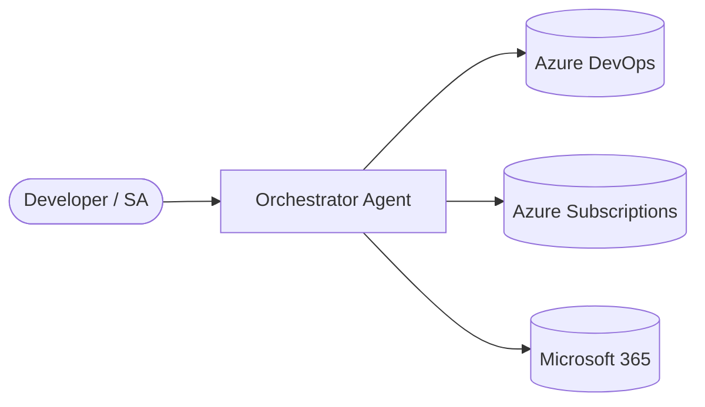

# Architecture

| Field | Value |
|-------|-------|
| **Version** | 1.0.0 |
| **Date** | 2026-05-18 |
| **Author** | Urs Rüegg |
| **Status** | Draft |
| **Previous Version** | — (initial release) |

> **Related**: [SOLUTION_OVERVIEW.md](SOLUTION_OVERVIEW.md) for the narrative
> design and use cases.

## Table of Contents

1. [System Context](#1-system-context)
2. [Container / Component View](#2-container--component-view)
3. [Agent Contracts](#3-agent-contracts)
4. [Tool Contracts](#4-tool-contracts)
5. [Data Flow](#5-data-flow)
6. [Non-Functional Requirements](#6-non-functional-requirements)
7. [Open Questions](#7-open-questions)
8. [References](#8-references)

## 1. System Context

*Describe the actors, external systems, and trust boundaries. Include a C4
context diagram (Mermaid).*

## 2. Container / Component View

*Per-component responsibilities, tech stack, runtime host, scaling model.*

| Component | Stack | Hosting | Scaling |
|-----------|-------|---------|---------|
| Orchestrator Agent | Python 3.11 / Agent Framework | TBD (Container Apps / Functions) | TBD |
| Spec Parser & Deployment Agent | Python 3.11 | TBD | TBD |
| Drift Analyzer Agent | Python 3.11 | TBD (Functions, scheduled) | TBD |
| PR Review Agent | Python 3.11 | TBD (Functions, webhook) | TBD |
| Azure DevOps MCP | Microsoft-hosted (remote) | N/A | N/A |
| WorkIQ MCP | Microsoft-hosted | N/A | N/A |

## 3. Agent Contracts

*For each agent, document: trigger, inputs, outputs, side effects, tools used,
human-approval gates, and failure modes.*

### 3.1 Orchestrator Agent
- **Trigger**: TBD
- **Inputs**: TBD
- **Outputs**: TBD
- **Tools**: TBD
- **Human gates**: TBD

### 3.2 Spec Parser & Deployment Agent
*TBD*

### 3.3 Drift Analyzer Agent
*TBD*

### 3.4 PR Review Agent
*TBD*

## 4. Tool Contracts

*Every tool must declare: name, description, input schema, output schema, side
effects, required permissions. Maintain in a registry (e.g., `tools/REGISTRY.md`).*

## 5. Data Flow

*High-level data-flow diagram from spec ingestion → deployment → audit trail.*

## 6. Non-Functional Requirements

| NFR | Target |
|-----|--------|
| Availability | TBD |
| Latency (p95 agent turn) | TBD |
| Cost per agent run | TBD |
| Recovery time objective (RTO) | TBD |
| Recovery point objective (RPO) | TBD |

## 7. Open Questions

- TBD

## 8. References
- [SOLUTION_OVERVIEW.md](SOLUTION_OVERVIEW.md)
- [SECURITY.md](SECURITY.md)
- [DATA.md](DATA.md)
- [INFRASTRUCTURE.md](INFRASTRUCTURE.md)
