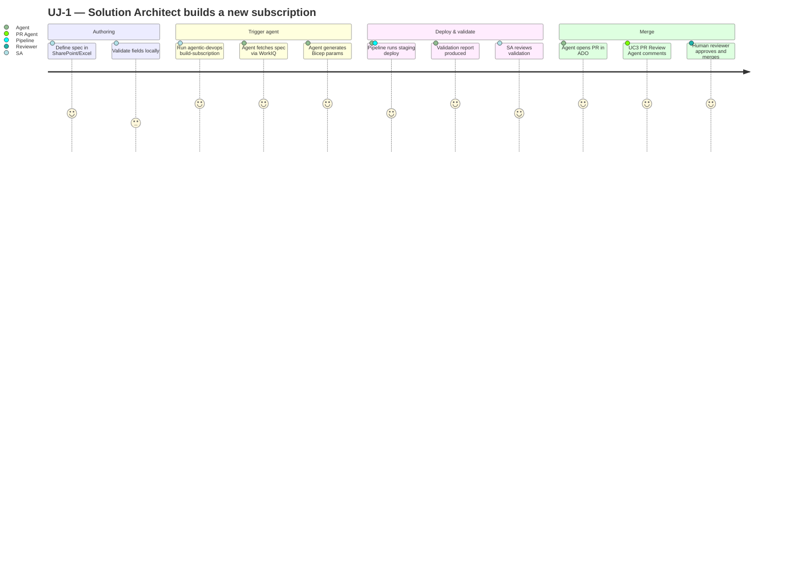
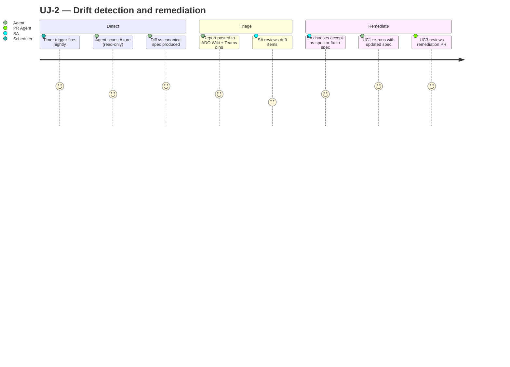
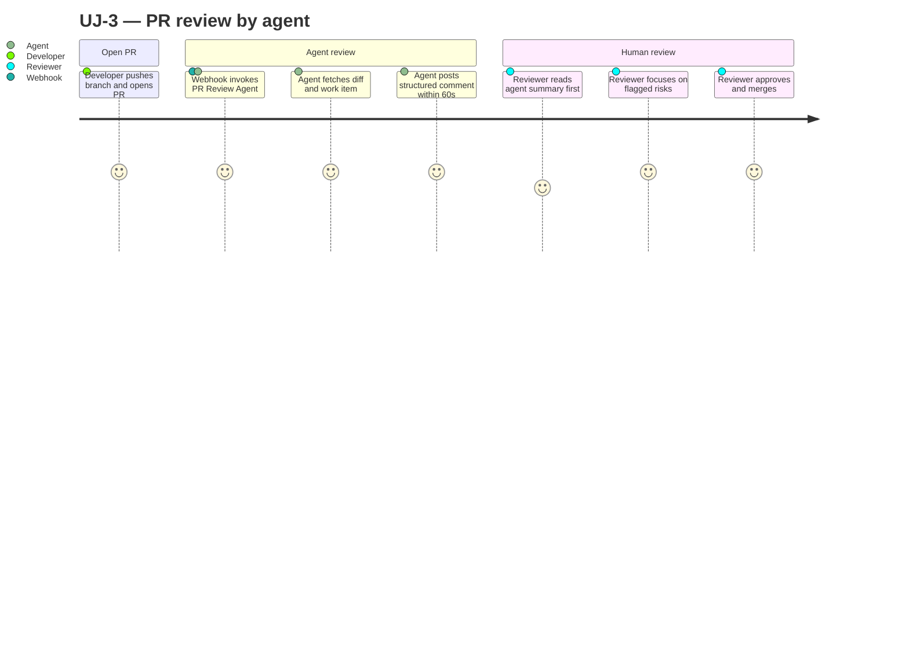
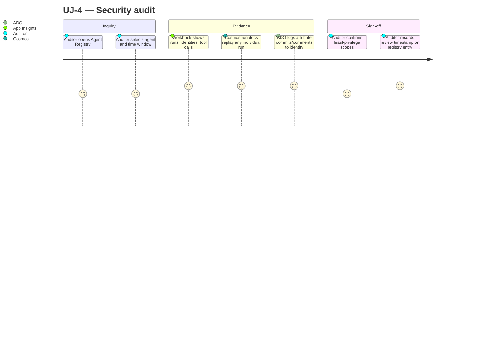
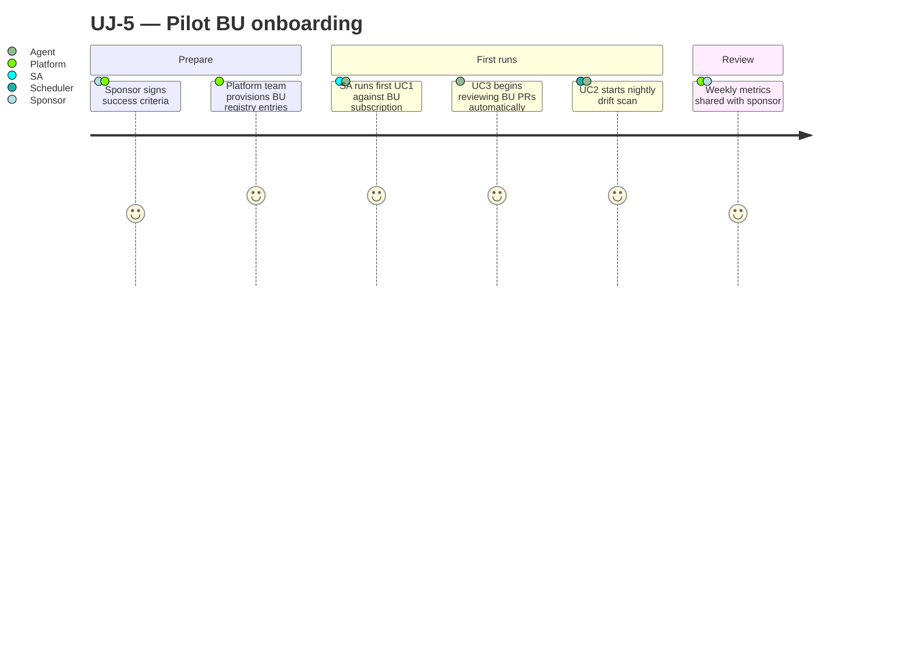

# Product Requirements Document (PRD) — Agentic DevOps Platform

| Field | Value |
|-------|-------|
| **Version** | 1.2.0 |
| **Date** | 2026-05-18 |
| **Author** | Urs Rüegg |
| **Status** | Draft |
| **Previous Version** | 1.0.0 (initial release; 1.1.0 added §7 traceability matrix; 1.2.0 added `FR-PLT-007`) |

> **Purpose**: Capture the **what** of the Agentic DevOps Platform — personas,
> user journeys, functional requirements, and non-functional requirements —
> with stable IDs so every requirement is traceable from definition through
> sprint delivery to test/eval evidence.
>
> **Companion documents**: [docs/SOLUTION_OVERVIEW.md](SOLUTION_OVERVIEW.md)
> (the **why** and high-level **how**) and [sprints/SPRINT_PLAN.md](../sprints/SPRINT_PLAN.md)
> (the **when**).

---

## Table of Contents

1. [Goals & Non-Goals](#1-goals--non-goals)
2. [Personas](#2-personas)
3. [User Journeys](#3-user-journeys)
4. [Functional Requirements](#4-functional-requirements)
5. [Non-Functional Requirements](#5-non-functional-requirements)
6. [Requirement ID Scheme](#6-requirement-id-scheme)
7. [Traceability Matrix](#7-traceability-matrix)
8. [Implementation-Time Traceability](#8-implementation-time-traceability)
9. [Acceptance Strategy](#9-acceptance-strategy)
10. [Open Questions](#10-open-questions)
11. [Related Documents](#11-related-documents)

---

## 1. Goals & Non-Goals

### Goals
- Enable an enterprise team to automate **subscription provisioning, drift
  detection, and PR review** through governed AI agents.
- Keep humans in the loop for every mutating action.
- Provide a **single, traceable specification** that drives sprints, code,
  tests, and audits.

### Non-Goals (in scope of this PRD)
- Multi-cloud support (Azure-only).
- Replacing human approvers — agents augment, never decide.
- Self-service onboarding beyond pilot (future phase).
- Real-time chat UX — orchestration is CLI/event-driven for v1.

---

## 2. Personas

| ID | Persona | Primary Goal | Pain Today |
|----|---------|--------------|-----------|
| **P1** | Solution Architect (SA) | Provision Azure landing zones aligned to spec | Manual, error-prone Bicep authoring; drift after months |
| **P2** | Developer / Engineer | Ship code through ADO PRs quickly | Slow reviews; inconsistent policy enforcement |
| **P3** | Platform Engineer | Operate the agent platform reliably | Tracing, troubleshooting, on-call burden |
| **P4** | Security / Compliance Reviewer | Audit access, identities, and changes | Fragmented evidence across tools |
| **P5** | Pilot BU Sponsor | Adopt the platform with measurable ROI | Uncertainty about scope, controls, support |

---

## 3. User Journeys

### 3.1 UJ-1 — SA Builds a New Subscription (UC1)

### 3.2 UJ-2 — Nightly Drift Detection (UC2)

### 3.3 UJ-3 — Developer Opens a PR (UC3)

### 3.4 UJ-4 — Security Reviewer Audits Agent Activity

### 3.5 UJ-5 — Pilot BU Onboarding

---

## 4. Functional Requirements

> Each FR has a stable ID. Acceptance evidence comes from the sprint user
> story listed in the [Traceability Matrix](#7-traceability-matrix).

### 4.1 UC1 — Subscription Build (FR-UC1-*)

| ID | Requirement | Priority |
|----|-------------|----------|
| **FR-UC1-001** | The Spec Parser Agent SHALL ingest landing-zone specs from a local JSON file. | Must |
| **FR-UC1-002** | The Spec Parser Agent SHALL ingest specs from a SharePoint/OneDrive file via WorkIQ MCP. | Must |
| **FR-UC1-003** | The Spec Parser Agent SHALL accept Excel (.xlsx) specs and map them deterministically to JSON. | Must |
| **FR-UC1-004** | The system SHALL validate every spec against a published JSON Schema and reject malformed specs with a path-pointing error message. | Must |
| **FR-UC1-005** | The Spec Parser Agent SHALL generate `.bicepparam` files deterministically (byte-identical output for the same spec). | Must |
| **FR-UC1-006** | The Spec Parser Agent SHALL trigger an ADO pipeline to deploy to a staging subscription. | Must |
| **FR-UC1-007** | The system SHALL compare deployed staging state against the spec and produce a structured validation report `{path, expected, actual, severity}`. | Must |
| **FR-UC1-008** | The system SHALL persist every validation report to Cosmos DB partitioned by `/agentRunId`. | Must |
| **FR-UC1-009** | The Spec Parser Agent SHALL create a branch, commit generated files, and open a pull request in ADO with the validation report attached. | Must |
| **FR-UC1-010** | Azure Policy SHALL be enforced on the staging subscription (required tags, allowed locations, deny public IPs). | Must |
| **FR-UC1-011** | The agent SHALL act under On-Behalf-Of (OBO) credentials when triggered by a signed-in user. | Must |
| **FR-UC1-012** | The agent SHALL fall back to a clearly labeled service identity when invoked autonomously. | Must |
| **FR-UC1-013** | The agent SHALL provide a `--dry-run` mode that prints all mutating actions without executing them. | Must |
| **FR-UC1-014** | A runbook SHALL document the end-to-end UC1 invocation, expected output, and troubleshooting steps. | Must |

### 4.2 UC2 — Drift Detection (FR-UC2-*)

| ID | Requirement | Priority |
|----|-------------|----------|
| **FR-UC2-001** | The system SHALL maintain a registry of tracked subscriptions with their canonical spec reference. | Must |
| **FR-UC2-002** | The Drift Analyzer Agent SHALL scan a tracked subscription in read-only mode (Reader RBAC). | Must |
| **FR-UC2-003** | A scheduled timer SHALL trigger drift scans nightly (default `0 0 2 * * *` UTC). | Must |
| **FR-UC2-004** | An on-demand CLI command SHALL trigger an immediate drift scan for a given subscription. | Must |
| **FR-UC2-005** | The diff engine SHALL classify each finding with a severity `info | warn | error` per documented rules. | Must |
| **FR-UC2-006** | Drift reports SHALL be persisted to Cosmos DB with a TTL of 180 days. | Must |
| **FR-UC2-007** | Drift reports SHALL be upserted to an ADO Wiki page at `/Drift/<subscriptionId>`. | Must |
| **FR-UC2-008** | Teams/email notifications SHALL be sent **only** when at least one `error`-severity finding exists. | Must |
| **FR-UC2-009** | The agent SHALL NOT auto-remediate drift. Remediation MUST flow through UC1. | Must |
| **FR-UC2-010** | A `remediate-drift` command SHALL pre-fill a UC1 invocation with the canonical spec reference. | Should |

### 4.3 UC3 — PR Review (FR-UC3-*)

| ID | Requirement | Priority |
|----|-------------|----------|
| **FR-UC3-001** | An ADO Service Hook SHALL invoke the PR Review Agent on PR `created` and `updated` events. | Must |
| **FR-UC3-002** | The webhook receiver SHALL authenticate inbound requests via shared secret + IP allowlist. | Must |
| **FR-UC3-003** | The PR Review Agent SHALL fetch PR diff, file list, PR description, and linked ADO Boards work item(s) via ADO MCP. | Must |
| **FR-UC3-004** | The agent SHALL fetch enterprise policy snippets from WorkIQ MCP. | Must |
| **FR-UC3-005** | The agent SHALL produce a structured analysis containing summary, compliance pass/fail table, scope-vs-work-item check, and risks. | Must |
| **FR-UC3-006** | The agent SHALL post exactly one comment per PR, identified by HTML marker `<!-- agentic-devops:pr-review -->`, and update that comment on subsequent runs. | Must |
| **FR-UC3-007** | The agent identity SHALL have ADO scopes limited to `Code (Read)`, `Pull Request Threads (R/W)`, `Work Items (Read)`. | Must |
| **FR-UC3-008** | The agent SHALL NOT have push, branch-policy, or merge permissions. | Must |
| **FR-UC3-009** | The agent SHALL redact token-like strings from comments before posting. | Must |
| **FR-UC3-010** | A path filter SHALL be configurable to scope which PRs the agent reviews (default: all). | Should |

### 4.4 Platform & Cross-Cutting (FR-PLT-*)

| ID | Requirement | Priority |
|----|-------------|----------|
| **FR-PLT-001** | An Orchestrator Agent SHALL accept natural-language prompts and delegate to specialized agents. | Must |
| **FR-PLT-002** | Every tool SHALL declare `name`, `description`, `input_schema`, `output_schema`, `side_effects ∈ {read, write, deploy, delete}`, and `required_permissions`. | Must |
| **FR-PLT-003** | Tools with side effects `deploy` or `delete` SHALL require an explicit `confirm=True` argument. | Must |
| **FR-PLT-004** | The system SHALL emit OpenTelemetry traces to Application Insights for every agent run, with one span per tool call. | Must |
| **FR-PLT-005** | The system SHALL persist one Cosmos DB run document per agent run with prompt, plan, tool calls, output, latency, tokens, actor identity, and timestamp. | Must |
| **FR-PLT-006** | An evaluation harness SHALL run golden tasks for every agent on PRs touching `agents/**`, `tools/**`, or `evals/**`. | Must |
| **FR-PLT-007** | A centralized Agent Registry SHALL store identity, owner, scopes, model deployment, prompt hash, eval baseline, and lifecycle status per agent. | Must |
| **FR-PLT-008** | The Agent Registry SHALL support pause/retire actions that prevent invocation of the affected agent. | Must |
| **FR-PLT-009** | A single CLI entry point (`agentic-devops`) SHALL provide subcommands for all user-facing flows. | Must |
| **FR-PLT-010** | Continuous evaluation SHALL run nightly across all agents on the curated golden set and trend the `agent.eval.passRate` metric. | Should |

---

## 5. Non-Functional Requirements

### 5.1 Security (NFR-SEC-*)

| ID | Requirement | Target |
|----|-------------|--------|
| **NFR-SEC-001** | All agent identities SHALL be Microsoft Entra Agent IDs with least-privilege RBAC scopes. | 100 % of agents |
| **NFR-SEC-002** | The system SHALL NOT use long-lived secrets in CI/CD. GitHub Actions → Azure SHALL use OIDC federation. | Audit clean |
| **NFR-SEC-003** | All runtime secrets SHALL be retrieved from Azure Key Vault via Managed Identity. | No secrets in code/config |
| **NFR-SEC-004** | Conditional Access policies SHALL be applied to every agent identity in `prod`. | 100 % coverage |
| **NFR-SEC-005** | The system SHALL conform to OWASP Top 10 (2021 list) for any public surface. | 0 high/critical findings |
| **NFR-SEC-006** | Tool inputs derived from LLM output SHALL be validated against schema before execution. | All write/deploy/delete tools |
| **NFR-SEC-007** | Logs SHALL NOT contain secrets, tokens, or PII. Sensitive fields SHALL be redacted at the logger. | 0 PII leaks per scan |
| **NFR-SEC-008** | In `prod`, Key Vault and Cosmos DB SHALL be accessed via private endpoints only. | 100 % |

### 5.2 Reliability (NFR-REL-*)

| ID | Requirement | Target |
|----|-------------|--------|
| **NFR-REL-001** | The UC1 happy-path SHALL complete (spec → staging deployed + validated) in **< 15 min** for a standard landing zone. | p95 |
| **NFR-REL-002** | The UC3 PR review SHALL post a comment within **< 60 s** of the PR event. | p95 |
| **NFR-REL-003** | The UC2 nightly drift scan SHALL complete within the 60-min window. | 100 % |
| **NFR-REL-004** | All Cosmos DB clients SHALL be singletons reusing connections; 429 responses SHALL be retried per the `retry-after` header. | All call sites |
| **NFR-REL-005** | Webhook events SHALL be idempotent: re-delivery SHALL NOT produce duplicate side effects. | 100 % |
| **NFR-REL-006** | Mutating agent actions SHALL be reversible or roll-back documented in a runbook. | 100 % |

### 5.3 Performance & Scalability (NFR-PERF-*, NFR-SCL-*)

| ID | Requirement | Target |
|----|-------------|--------|
| **NFR-PERF-001** | A drift scan over a subscription with ≤ 200 resources SHALL complete in **< 5 min**. | p95 |
| **NFR-PERF-002** | The PR Review Agent SHALL sustain throughput of **≥ 30 PR reviews / hour** in `dev`. | Baseline |
| **NFR-PERF-003** | Continuous-eval token spend SHALL be capped per nightly run. Exceeding the cap SHALL alert + halt. | Cap = USD X (defined by S6) |
| **NFR-SCL-001** | Cosmos DB containers SHALL use high-cardinality partition keys. | All containers |
| **NFR-SCL-002** | Hierarchical Partition Keys (HPK) SHALL be used when a single logical partition could exceed 20 GB. | All long-lived containers |
| **NFR-SCL-003** | The platform SHALL support ≥ 5 pilot BUs without architectural change. | Pilot to GA |

### 5.4 Observability (NFR-OBS-*)

| ID | Requirement | Target |
|----|-------------|--------|
| **NFR-OBS-001** | Every agent action SHALL emit a custom event with `agentId`, `actorIdentity`, `tenantId`, `latencyMs`, `tokenUsage`, `cost`. | 100 % |
| **NFR-OBS-002** | A central workbook SHALL show runs/day, p95 latency, eval pass-rate trend, top failing prompts per agent. | Available in `dev` from Sprint 6 |
| **NFR-OBS-003** | Every commit, comment, and pipeline trigger SHALL be attributable to a unique identity in audit logs. | 100 % |
| **NFR-OBS-004** | Trace retention SHALL be 90 days `dev`, 365 days `prod`. | Cosmos TTL + AI retention |

### 5.5 Governance & Compliance (NFR-GOV-*)

| ID | Requirement | Target |
|----|-------------|--------|
| **NFR-GOV-001** | The agent SHALL NOT auto-merge any pull request. | 100 % |
| **NFR-GOV-002** | Every mutating action SHALL require human approval (interactive `confirm` or PR review). | 100 % |
| **NFR-GOV-003** | Cross-cutting decisions SHALL be captured as ADRs in `docs/adr/`. | 100 % |
| **NFR-GOV-004** | Commit messages SHALL follow Conventional Commits. | CI-enforced |
| **NFR-GOV-005** | Code coverage SHALL be ≥ 80 % on changed files in every PR. | CI-enforced |
| **NFR-GOV-006** | Every PR SHALL declare the requirement IDs (FR-* / NFR-*) it implements. | Template-enforced (this PRD §8) |
| **NFR-GOV-007** | All agent identities SHALL undergo a quarterly access review. | Logged in registry `lastReviewedAt` |

### 5.6 Usability & Maintainability (NFR-USE-*, NFR-MAINT-*)

| ID | Requirement | Target |
|----|-------------|--------|
| **NFR-USE-001** | Error messages SHALL include a remediation hint or a link to a runbook. | 100 % of user-facing errors |
| **NFR-USE-002** | A runbook SHALL exist for the top 5 incident classes (Sprint 6 §S6-5). | 5/5 published |
| **NFR-MAINT-001** | Public Python functions SHALL have type hints; structured payloads SHALL use Pydantic models. | 100 % new code |
| **NFR-MAINT-002** | Every doc SHALL include a standardized metadata header (Version/Date/Author/Status/Previous Version) and Table of Contents. | 100 % docs |
| **NFR-MAINT-003** | New tools SHALL ship with at least one happy-path and one failure-path test. | 100 % |

### 5.7 Data (NFR-DAT-*)

| ID | Requirement | Target |
|----|-------------|--------|
| **NFR-DAT-001** | Drift reports SHALL be retained 180 days. | Cosmos TTL |
| **NFR-DAT-002** | Agent runs SHALL be retained 90 days `dev`, 365 days `prod`. | Cosmos TTL |
| **NFR-DAT-003** | Spec files SHALL NOT be persisted in plaintext outside Key Vault-protected stores. | 100 % |
| **NFR-DAT-004** | Backups SHALL be enabled on Cosmos DB (periodic in `dev`, continuous in `prod`). | Verified in IaC |

---

## 6. Requirement ID Scheme

| Prefix | Domain |
|--------|--------|
| `FR-UC1-NNN` | Functional, Use Case 1 (Subscription Build) |
| `FR-UC2-NNN` | Functional, Use Case 2 (Drift) |
| `FR-UC3-NNN` | Functional, Use Case 3 (PR Review) |
| `FR-PLT-NNN` | Functional, cross-cutting Platform |
| `NFR-SEC-NNN` | Non-functional, Security |
| `NFR-REL-NNN` | Non-functional, Reliability |
| `NFR-PERF-NNN` | Non-functional, Performance |
| `NFR-SCL-NNN` | Non-functional, Scalability |
| `NFR-OBS-NNN` | Non-functional, Observability |
| `NFR-GOV-NNN` | Non-functional, Governance & Compliance |
| `NFR-USE-NNN` | Non-functional, Usability |
| `NFR-MAINT-NNN` | Non-functional, Maintainability |
| `NFR-DAT-NNN` | Non-functional, Data |
| `UJ-N` | User Journey |
| `P-N` | Persona |
| `S{N}-{n}` | Sprint user story (defined in `sprints/`) |

**Rules**
- IDs are **immutable** once published. Deprecate by changing status, never by renumbering.
- New requirements get the next sequential number in the relevant prefix; gaps are not closed.
- Status field: `Proposed | Accepted | In Progress | Verified | Deprecated`. (Tracked in §7 once Sprint 0 begins.)

---

## 7. Traceability Matrix

> The matrix maps every FR/NFR to the sprint(s) and user-story IDs that deliver
> it, plus the eval/runbook artefact that verifies it. Update this table when
> a sprint changes scope.

### 7.1 Functional Requirements

| Requirement | Sprint | User Stories | Verification |
|-------------|--------|--------------|--------------|
| FR-UC1-001 | S2 | S2-1, S2-2 | `evals/tasks/uc1/happy-path.yaml` |
| FR-UC1-002 | S3 | S3-1 | `evals/tasks/uc1/sharepoint-spec.yaml` |
| FR-UC1-003 | S3 | S3-1 | `evals/tasks/uc1/excel-spec.yaml` |
| FR-UC1-004 | S2 | S2-1 | Unit tests + `evals/tasks/uc1/malformed-spec.yaml` |
| FR-UC1-005 | S2 | S2-2 | Deterministic-output unit test |
| FR-UC1-006 | S2 | S2-4 | E2E test against `rg-agentic-devops-stg-*` |
| FR-UC1-007 | S2 | S2-5 | `evals/tasks/uc1/validation-report.yaml` |
| FR-UC1-008 | S2 | S2-5 | Cosmos doc assertion in integration test |
| FR-UC1-009 | S3 | S3-2 | `evals/tasks/uc1/pr-open.yaml` |
| FR-UC1-010 | S3 | S3-3 | `evals/tasks/uc1/policy-violation.yaml` |
| FR-UC1-011 | S3 | S3-4 | OBO integration test + audit-log assertion |
| FR-UC1-012 | S3 | S3-4 | Service-identity integration test |
| FR-UC1-013 | S1, S2 | S1-5, S2-4 | CLI flag test, dry-run unit test |
| FR-UC1-014 | S3 | S3-6 | `docs/runbooks/uc1-build-subscription.md` review |
| FR-UC2-001 | S5 | S5-1 | Registry CRUD unit tests |
| FR-UC2-002 | S5 | S5-2 | Negative-test: write attempts return 403 |
| FR-UC2-003 | S5 | S5-5 | Function timer-trigger run history |
| FR-UC2-004 | S5 | S5-5 | CLI integration test |
| FR-UC2-005 | S5 | S5-3 | Diff-engine unit tests per severity tier |
| FR-UC2-006 | S5 | S5-4 | Cosmos doc + TTL assertion |
| FR-UC2-007 | S5 | S5-4 | Wiki upsert integration test |
| FR-UC2-008 | S5 | S5-4 | Notification test (error-only) |
| FR-UC2-009 | S5 | S5-6 | Architecture review; no auto-write tools registered |
| FR-UC2-010 | S5 | S5-6 | CLI flow test |
| FR-UC3-001 | S4 | S4-1 | Webhook integration test |
| FR-UC3-002 | S4 | S4-1 | Negative test: bad secret/IP rejected |
| FR-UC3-003 | S4 | S4-2 | `evals/tasks/uc3/diff-fetch.yaml` |
| FR-UC3-004 | S4 | S4-3 | `evals/tasks/uc3/policy-fetch.yaml` |
| FR-UC3-005 | S4 | S4-3, S4-4 | Eval fixtures (5 PR scenarios) |
| FR-UC3-006 | S4 | S4-4 | Idempotency unit + integration test |
| FR-UC3-007 | S4 | S4-5 | RBAC assertion in IaC tests |
| FR-UC3-008 | S4 | S4-5 | Negative test: push attempt returns 403 |
| FR-UC3-009 | S4 | S4-4 | `evals/tasks/uc3/secret-in-diff.yaml` |
| FR-UC3-010 | S4 | S4-1 | Config-driven path-filter test |
| FR-PLT-001 | S1 | S1-1 | `evals/tasks/smoke_echo.yaml` |
| FR-PLT-002 | S1 | S1-2 | Tool-contract schema tests |
| FR-PLT-003 | S1 | S1-2, S1-5 | Dry-run + confirm enforcement tests |
| FR-PLT-004 | S1 | S1-3 | App Insights span assertion in integration test |
| FR-PLT-005 | S1 | S1-3 | Cosmos run-doc schema test |
| FR-PLT-006 | S1 | S1-4 | `.github/workflows/eval.yml` runs golden tasks |
| FR-PLT-007 | S6 | S6-1 | Registry CRUD + schema tests |
| FR-PLT-008 | S6 | S6-1 | Paused-agent rejects invocation test |
| FR-PLT-009 | S1, S2+ | S1-1, all sprint CLIs | CLI integration tests |
| FR-PLT-010 | S6 | S6-4 | `.github/workflows/eval-nightly.yml` execution log |

### 7.2 Non-Functional Requirements

| Requirement | Sprint | User Stories | Verification |
|-------------|--------|--------------|--------------|
| NFR-SEC-001 | S0, S3, S4, S5, S6 | S0-4, S3-4, S4-5, S5-2, S6-1 | Entra audit + IaC tests |
| NFR-SEC-002 | S0 | S0-3 | `deploy-dev.yml` review; no secrets in repo |
| NFR-SEC-003 | S0, S1 | S0-2, S1-1 | Code scan: no inline secrets; KV references only |
| NFR-SEC-004 | S6 | S6-2 | CA report-only audit + enforced policy review |
| NFR-SEC-005 | S4, S6 | S4-1, S6-6 | CodeQL + dependency scans in CI |
| NFR-SEC-006 | S1, S4 | S1-2, S4-3 | Pydantic validation tests |
| NFR-SEC-007 | All | All | Logging policy audit + redaction unit tests |
| NFR-SEC-008 | S6 | S6-6 | Private-endpoint IaC tests |
| NFR-REL-001 | S2, S3 | S2-4, S3-5 | Timed E2E test |
| NFR-REL-002 | S4 | S4-6 | Latency metric `pr_review.latency_ms` |
| NFR-REL-003 | S5 | S5-5 | Function execution history; missed-run alert |
| NFR-REL-004 | S1 | S1-3 | Singleton client unit test + 429 retry test |
| NFR-REL-005 | S4, S5 | S4-1, S5-5 | Idempotency integration tests |
| NFR-REL-006 | S6 | S6-5 | Runbooks `docs/runbooks/incident-*.md` |
| NFR-PERF-001 | S5 | S5-2 | Timed scan test |
| NFR-PERF-002 | S4 | S4-6 | Throughput test |
| NFR-PERF-003 | S6 | S6-4 | Token-cap enforcement in `eval-nightly.yml` |
| NFR-SCL-001 | S1, S2, S5 | S1-3, S2-5, S5-4 | Partition-key schema review |
| NFR-SCL-002 | S6 | S6-3 | HPK design ADR-0003 (followed up in S6 if needed) |
| NFR-SCL-003 | S6 | S6-7 | Onboarding guide for second BU validated |
| NFR-OBS-001 | S1, S6 | S1-3, S6-3 | Custom-event schema test |
| NFR-OBS-002 | S6 | S6-3 | Workbook JSON in IaC + manual verification |
| NFR-OBS-003 | S3, S4, S5 | S3-4, S4-5, S5-2 | Audit-log assertion tests |
| NFR-OBS-004 | S1, S6 | S1-3, S6-3 | TTL config in IaC |
| NFR-GOV-001 | S4 | S4-5 | Negative test in S4 demo |
| NFR-GOV-002 | S1, S2, S3 | S1-5, S2-4, S3-2 | Confirm-flag enforcement tests |
| NFR-GOV-003 | All | ADRs per sprint | `docs/adr/` index |
| NFR-GOV-004 | S0 | S0-1 | CI check (commitlint or equivalent) |
| NFR-GOV-005 | S0, S1 | S0-1, S1-4 | Coverage gate in CI |
| NFR-GOV-006 | S0 | S0-1 | `.github/PULL_REQUEST_TEMPLATE.md` enforced via CI |
| NFR-GOV-007 | S6 | S6-1 | Registry `lastReviewedAt` audit |
| NFR-USE-001 | All | All | Error-message review per PR |
| NFR-USE-002 | S6 | S6-5 | Runbooks count = 5 |
| NFR-MAINT-001 | S0, S1 | S0-1, S1-2 | `mypy --strict` and Pydantic enforcement in CI |
| NFR-MAINT-002 | S0 + all docs | doc PRs | Doc lint or manual review |
| NFR-MAINT-003 | S1+ | per-tool stories | Test-count check per tool |
| NFR-DAT-001 | S5 | S5-4 | Cosmos TTL set in IaC |
| NFR-DAT-002 | S1, S6 | S1-3, S6-3 | Cosmos TTL set in IaC |
| NFR-DAT-003 | S3 | S3-1 | Logging review; spec content never persisted |
| NFR-DAT-004 | S0, S6 | S0-2, S6-6 | Bicep backup policy assertion |

### 7.3 User Journey Coverage

| Journey | Persona | Use Case | Requirements (representative) |
|---------|---------|----------|-------------------------------|
| **UJ-1** | P1 | UC1 | FR-UC1-001…014, FR-PLT-001…006 |
| **UJ-2** | P1, P3 | UC2 | FR-UC2-001…010, FR-UC1-009 (re-uses UC1 PR open) |
| **UJ-3** | P2 | UC3 | FR-UC3-001…010, NFR-REL-002 |
| **UJ-4** | P4 | All | NFR-SEC-001/004/007, NFR-OBS-001/003, NFR-GOV-007, FR-PLT-007 |
| **UJ-5** | P5 | All | FR-PLT-007, NFR-SCL-003, NFR-USE-002 |

---

## 8. Implementation-Time Traceability

Traceability does not stop at the PRD. Every artefact produced during
implementation MUST reference the requirement IDs it advances:

1. **Sprint user stories** — Each sprint document lists the requirement IDs
   covered. Authoritative mapping lives in [§7](#7-traceability-matrix).
2. **Issues / work items** — ADO Boards work items (and GitHub Issues for the
   sample) include the requirement IDs in their description.
3. **Branches** — Feature branches MAY embed a requirement reference
   (`feat/fr-uc1-009-pr-open`). Not enforced.
4. **Commits** — Conventional Commits scope SHOULD reference the requirement
   group (`feat(uc1): generate bicep params [FR-UC1-005]`).
5. **Pull requests** — The PR template `.github/PULL_REQUEST_TEMPLATE.md`
   REQUIRES a `Requirements implemented` section listing FR/NFR IDs.
   This is enforced per [NFR-GOV-006](#56-governance--compliance-nfr-gov-).
6. **Tests & evals** — Test files and eval task YAMLs SHALL include a
   `requirement` key (or docstring tag) referencing the requirement ID(s)
   they verify.
   Example test docstring: `"""Verifies FR-UC1-005 deterministic Bicep generation."""`.
7. **Code comments** — Where business logic implements a specific requirement,
   a comment of the form `# implements: FR-UC3-009` SHOULD appear at the
   function or class level.
8. **Audit dashboard** — App Insights custom event `agent.run.end` SHALL
   include a `requirementsCovered: [FR-*, NFR-*]` field where applicable.

> The Copilot agent and human contributors are responsible for keeping the
> traceability matrix in §7 up to date as scope evolves.

---

## 9. Acceptance Strategy

A requirement is considered **Verified** when all of the following are true:

1. The implementing sprint's user-story acceptance criteria are met.
2. CI has executed the test(s) and/or eval(s) listed in §7 successfully.
3. A demo or runbook step exercises the requirement at least once in `dev`.
4. The requirement status is updated to `Verified` (manual step performed
   at sprint retro; tracked in a status column to be added to §7 once
   Sprint 0 starts).

Requirements not yet implemented remain `Accepted` (this PRD's default for v1.0).

---

## 10. Open Questions

- [ ] Adopt a separate `docs/REQUIREMENT_STATUS.md` table (machine-friendly)
      or keep status inline in §7? (Decision by end of Sprint 0.)
- [ ] Mandate `requirement` tag in every test, or limit to integration/eval
      level only? (Decision by end of Sprint 1.)
- [ ] Use Azure DevOps Boards or GitHub Issues as the canonical work-item
      surface for the sample? (Affects how PR ↔ requirement linkage is shown.)
- [ ] Should NFR-PERF-003 token cap be a fixed USD amount or a percentage of
      monthly Azure OpenAI budget? (Decision by Sprint 6.)

---

## 11. Related Documents

- [docs/SOLUTION_OVERVIEW.md](SOLUTION_OVERVIEW.md) — narrative and architecture context
- [docs/ARCHITECTURE.md](ARCHITECTURE.md) — system architecture
- [docs/AI.md](AI.md) — agent governance and evaluation
- [docs/SECURITY.md](SECURITY.md) — identity and security controls
- [docs/DATA.md](DATA.md) — data model
- [docs/TEST.md](TEST.md) — test strategy
- [sprints/SPRINT_PLAN.md](../sprints/SPRINT_PLAN.md) — sprint sequencing
- [sprints/README.md](../sprints/README.md) — sprint index
- [.github/copilot-instructions.md](../.github/copilot-instructions.md) — repo conventions
- [.github/PULL_REQUEST_TEMPLATE.md](../.github/PULL_REQUEST_TEMPLATE.md) — PR contract (enforces NFR-GOV-006)
