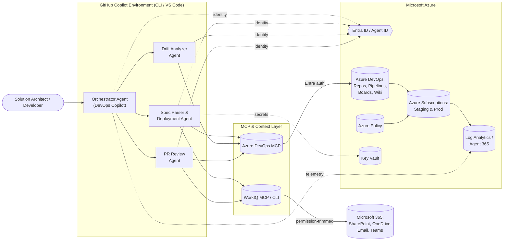
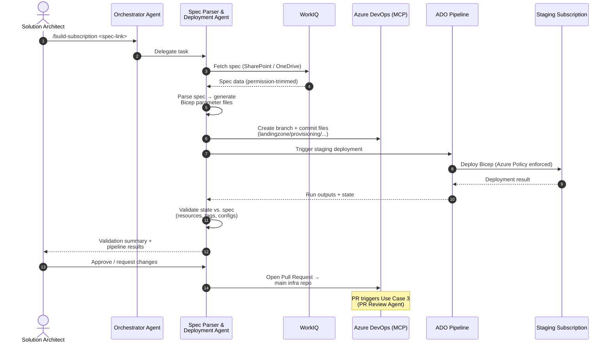
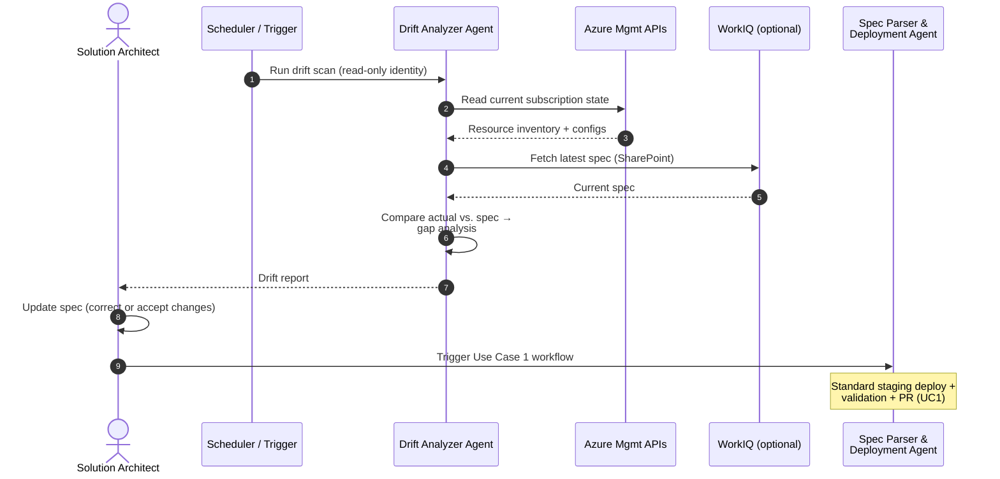
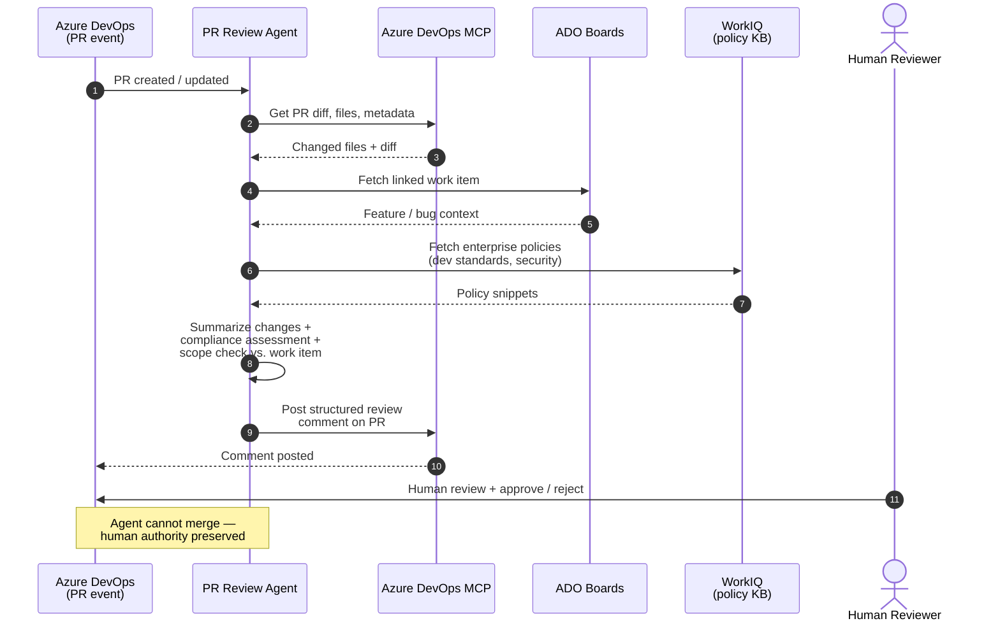
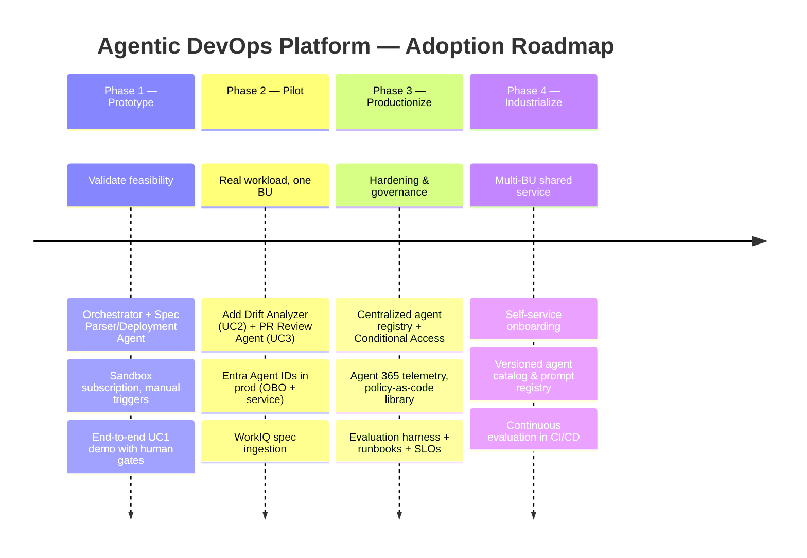

# Solution Overview — Agentic DevOps Platform

**Integrating Azure DevOps with GitHub Copilot Agents and WorkIQ**

| Field | Value |
|-------|-------|
| **Version** | 1.0.0 |
| **Date** | 2026-05-18 |
| **Author** | Urs Rüegg |
| **Status** | Draft |
| **Previous Version** | — (initial release) |

> **Audience**: Solution architects, platform engineers, security & compliance owners
> **Scope**: Target architecture for an enterprise-grade Agentic DevOps platform that
> automates Azure DevOps (ADO) workflows using GitHub Copilot Agents and WorkIQ while
> maintaining strict governance.

---

## Table of Contents

1. [Executive Summary](#1-executive-summary)
2. [Strategic & Technical Objectives](#2-strategic--technical-objectives)
3. [Solution Architecture](#3-solution-architecture)
4. [Components and Responsibilities](#4-components-and-responsibilities)
5. [Use Case Implementations](#5-use-case-implementations)
6. [Governance & Compliance](#6-governance--compliance)
7. [Key Risks & Mitigations](#7-key-risks--mitigations)
8. [Phased Roadmap](#8-phased-roadmap)
9. [Conclusion](#9-conclusion)
10. [Glossary](#10-glossary)
11. [References & Related Documents](#11-references--related-documents)

---

## 1. Executive Summary

This document describes the target **Agentic DevOps** platform: a system that
orchestrates multiple AI agents to handle end-to-end DevOps tasks across Azure
DevOps pipelines and GitHub Copilot. It covers three critical use cases:

1. **Initial Azure subscription build** (landing-zone provisioning).
2. **Subscription updates** (configuration drift and change management).
3. **Pull request reviews and compliance** (automated PR analysis).

Each use case is implemented with specialized agents and integrates with WorkIQ
(via CLI or MCP) to inject enterprise context (policies, M365 data) where needed,
all under enterprise-grade controls for identity, compliance, auditing, and
human oversight.

---

## 2. Strategic & Technical Objectives

| Objective | Description |
|-----------|-------------|
| **Automate DevOps workflows** | Use AI agents to eliminate manual tasks in ADO subscription provisioning and code deployment. |
| **Governance by design** | Enforce identity & access via Microsoft Entra ID (Agent ID), policy-as-code (Azure Policy, Bicep/ARM validations), auditing & non-repudiation, and human-in-the-loop oversight for critical changes. |
| **Shared services & growth** | Design agents as reusable services that scale across projects, with clear orchestration layers and a centralized control plane (envisioned as part of *Agent 365*). |
| **Industrialize agentic workflows** | Define a phased roadmap from prototyping to full-scale enterprise adoption. |

---

## 3. Solution Architecture

### 3.1 High-Level Topology

### 3.2 Orchestrator Agent (DevOps Copilot)

At the heart of the platform is an **Orchestrator Agent** running in the GitHub
Copilot environment (Copilot CLI / VS Code). It is the central brain of the
solution: it receives natural-language instructions from a user or trigger,
breaks down the task, and dynamically delegates work to specialized agents or
tools.

### 3.3 Specialized Agents

| Agent | Use Case | Responsibilities |
|-------|----------|------------------|
| **Spec Parser & Deployment Agent** | UC1, UC2 | Reads structured spec inputs (e.g., Excel or JSON containing subscription requirements). Produces Bicep parameter files. Triggers a staging deployment via an ADO pipeline for validation. Verifies all resources/configurations before committing code. |
| **Drift Analyzer Agent** | UC2 | Scans an existing Azure subscription and compares actual state vs. specification (the latest spreadsheet). Flags configuration drift or missing resources. |
| **PR Review Agent** | UC3 | Monitors new pull requests in ADO. Uses AI to summarize code/infrastructure changes, verifies compliance with enterprise policies, and checks alignment with the linked ADO Boards work item. Posts a structured review comment to assist human reviewers. |

### 3.4 Integration & Tooling

The Orchestrator Agent uses GitHub Copilot's multi-tool capabilities (via MCP
servers or plugins in Copilot CLI) to connect all necessary systems:

#### Azure DevOps MCP (Remote)
First-party integration providing AI-friendly access to ADO services (Repos,
Pipelines, Boards, Wiki). Allows Copilot Agents to read/write directly in ADO:
listing projects, retrieving and updating repository files, running pipelines,
creating work items, and posting PR comments. The Azure DevOps MCP uses
**Microsoft Entra ID** for trusted authentication — the ADO organization must
be Entra-backed. Agent actions on ADO inherit enterprise sign-in controls and
can be traced to an identity in audit logs.

#### WorkIQ (M365 Intelligence Layer)
Microsoft's enterprise context layer for M365, accessible via CLI or an MCP
server. Bridges the user's work context into the agent's reasoning. Used here
to fetch semi-structured data living in M365 (e.g., a specification spreadsheet
in SharePoint/OneDrive, internal standards documentation for compliance checks)
and provide it to the Copilot agents. The WorkIQ MCP only returns data that the
acting identity (user or service) is permitted to see, preserving security.

#### Entra ID & Agent Identity
All agent actions execute under a managed identity via Microsoft Entra ID.
**Entra Agent ID** extends zero-trust identity controls to AI agents, making
them first-class identities with enforceable authentication and governance
policies. Two patterns are used:

- **On-Behalf-Of (OBO)** — for user-triggered workflows. The agent acts with the
  requesting user's delegated credentials and cannot exceed the user's permissions.
- **Service-agent identity (non-OBO)** — for autonomous tasks such as automated
  PR reviews. A dedicated identity is provisioned with **narrow ADO permissions**
  (e.g., read-only for code, comment-posting rights) assigned via Entra roles.

All agent identities are registered in a central **Agent Registry** (part of
*Agent 365* / Entra) for monitoring and consistent policy enforcement.
Conditional Access policies and anomaly detection apply to these identities
(e.g., blocking agent actions if credentials are compromised or misused).

### 3.5 Guardrails & Policy-as-Code

Each agent encodes enterprise policies and standards into its logic (explicit
instructions, prompt constraints, integrated knowledge):

- **Spec Parser** — ensures all landing-zone resources include mandatory tags
  and naming conventions, verified by Bicep linter checks or by referencing a
  corporate tagging policy document via WorkIQ.
- **Deployment Agent** — leverages **Azure Policy** (attached to staging
  subscriptions) to automatically enforce baseline security/compliance settings
  during test deployments. Runs post-deployment validation scripts to confirm
  deployed resources match the specification exactly (comparing provisioned
  resource properties against the Bicep parameters).
- **PR Review Agent** — uses policy knowledge (internal dev-standards wiki or
  code policy document from ADO/SharePoint) to check that changes conform to
  enterprise standards and security rules. Confirms the PR scope aligns with
  the intended ADO Boards work item (no unexpected changes beyond the linked
  feature's scope).

All checks are codified as **decision gates** in the agent's prompt logic or as
separate verification tools invoked by the agent.

### 3.6 Human Oversight & Non-Repudiation

Human-in-the-loop control is fundamental. No destructive action occurs without
human awareness and approval.

- **Buddy checks** — for critical steps, the agent either prompts the user for
  explicit approval or defers final action until a designated reviewer approves.
  Copilot agents are configured to perform mutating actions (e.g., creating ADO
  work items) only after the user types a confirmation. The PR Review Agent
  only **posts** comments — it cannot auto-merge code.
- **Pull requests for code changes** — any code authored by an agent (e.g., new
  Bicep files in UC1) is committed to a feature branch and goes through the
  standard PR process. Two-level approvals apply: the agent's own validation,
  then peer review via PR. The PR itself triggers automated tests and security
  scans.
- **Audit & logging** — all agent actions are performed through traceable
  channels. ADO logs capture actions (commits, pipeline triggers, PR comments)
  and attribute them to either the requesting user or the agent's service
  identity, supporting non-repudiation. An **Agent Control Plane** (e.g.,
  *Microsoft Agent 365*) collects telemetry on agent operations — when they run,
  what tools they invoked, and outputs — for compliance reviews and forensic
  analysis.

---

## 4. Components and Responsibilities

| Component | Role & Responsibilities |
|-----------|------------------------|
| **GitHub Copilot CLI & Agents (Orchestrator)** | Central orchestration engine: interprets requests, sequences multi-step workflows, and delegates tasks across other agents and tools. Provides a developer-friendly environment (VS Code / CLI) for customizing and versioning agent instructions. |
| **Azure DevOps MCP (Remote server)** | Secure ADO integration: AI-friendly APIs for ADO (Boards, Repos, Pipelines, Wiki) under Entra ID authentication. Lets agents create/modify work items, read/write repo files, trigger pipelines, and comment on PRs programmatically. |
| **WorkIQ (M365 intelligence layer)** | Context provider: supplies permission-trimmed organizational data (files, emails, meeting transcripts, etc.) to agents via CLI/MCP. Used to ingest spec spreadsheets or policy documents stored in M365 for richer reasoning grounded in real enterprise data. |
| **Spec Parser & Deployment Agent** | UC1 & UC2: reads landing-zone spec (Excel/SharePoint or JSON), generates Bicep parameter files, triggers staging deployment via ADO pipeline. Includes a validation subroutine to compare the staged subscription's properties to the spec (VNETs, tags, resources) and only then commits code and opens a PR. |
| **Drift Analyzer Agent** | UC2 (updates): scans an existing Azure subscription (via script or Azure APIs) to gather current configurations and compare against the spec. Produces a gap-analysis report (missing or mismatched settings) for the solution architect, who updates the spec before re-running the deployment agent. |
| **PR Review Agent** | UC3: triggered on ADO PR creation, uses AI to summarize code/infrastructure changes, cross-checks them against enterprise policies & standards (encoded in its prompt or fetched via WorkIQ) and against the intended ADO Board work item (via MCP). Posts a summary and compliance assessment as a comment for human reviewers. |

---

## 5. Use Case Implementations

### 5.1 Use Case 1 — Initial Azure Subscription Build (Landing Zone Provisioning)

**Trigger**: Solution Architect (SA) initiates the process — e.g., a
`/build-subscription` command in Copilot CLI or a UI trigger.

#### Workflow

#### Details

The Orchestrator uses WorkIQ (if needed) to fetch the spec file from where it
is stored (e.g., a SharePoint link to an Excel) and extracts the input data —
network ranges, resource lists, tags, etc. The agent writes Bicep parameter
files (and possibly other IaC templates) into the correct ADO repo directories
through the Azure DevOps MCP: opening the repository and creating/updating
files in a new branch (e.g., `landingzone/provisioning/parameters/prod.bicepparam`).

The agent applies enterprise checks: verifying policy compliance (all required
tags present, naming conventions correct) and running a local Bicep `what-if`
or lint to catch errors early. Next, via ADO (MCP or pipeline API), it triggers
the standard infra-as-code pipeline (Bicep deployment) into a temporary
**staging subscription**. This is the same proven pipeline DevOps engineers run
today, ensuring consistency and reuse. Standard Azure security controls apply:
any violation of Azure Policies or governance rules causes the deployment to
fail, giving immediate feedback on non-compliant configurations.

Once complete, the agent queries staging state (via Azure APIs or pipeline
outputs) and cross-checks against the spec parameters. It compiles a
**validation summary** listing each resource and configuration, highlighting
mismatches (e.g., a tag value in Azure not matching the spec). The SA reviews
this summary along with pipeline results.

#### Governance

The SA remains in control. If issues are found or anything looks suspicious,
the SA adjusts the spec and asks the agent to re-run. No code is merged to
production without human review. If approved, the agent commits the new Bicep
files and opens a pull request (in ADO) targeting the main infrastructure repo
branch. The commit uses either the SA's credentials (OBO) or a clearly
labeled service identity (e.g., `AI-DevOps-Bot`) for transparency. The PR —
with the full context of changes and the automated validation report attached —
then moves to **Use Case 3** for final oversight.

### 5.2 Use Case 2 — Subscription Updates (Drift & Change Management)

**Trigger**: Periodic schedule (e.g., nightly job) or explicit `check-drift`
command.

#### Workflow

#### Details

This scenario extends UC1 with a feedback loop to manage change over the
subscription lifecycle. Periodic or event-driven drift detection keeps the
spreadsheet (the single source of truth) in sync with reality. The Drift
Analyzer Agent scans the Azure subscription state via Azure management APIs or
IaC tooling (`az` CLI, Terraform plan). The output is a **report of differences**
between deployed resources and the official spec — missing tags, mismatched
SKUs, out-of-policy resources. Findings can be enriched by WorkIQ with context
(e.g., correlating an out-of-compliance resource to the person or process that
created it).

The SA reviews the drift report and updates the specification file as needed —
to correct discrepancies or incorporate new desired changes. The SA then
triggers the Spec Parser / Deployment Agent (UC1's workflow) again, treating
the update like a fresh deployment request. The agent regenerates Bicep
parameter files with new changes and re-runs the staging deployment +
validation cycle. If validation passes, changes are committed and submitted as
an update PR, again requiring human approval before merge.

#### Governance

UC2 reinforces strong configuration governance. By scanning for drift and
forcing changes back through the formal pipeline (Bicep regen + PR review), it
**prevents shadow changes** and ensures compliance at all times. The drift-scan
agent runs in **read-only mode** with a restricted monitoring identity. It
does not alter anything directly — only raises alerts on unsanctioned changes.
The final re-provisioning is funneled through UC1, so no changes are deployed
without standard tests, policy checks, and PR approvals.

### 5.3 Use Case 3 — Pull Request Reviews and Compliance

**Trigger**: New PR created or updated in the ADO repository — via an ADO
extension or pipeline subscription that calls the agent.

#### Workflow

#### Details

The PR Review Agent gathers PR context via the Azure DevOps MCP (or direct ADO
APIs): list of changed files, code diffs, and the PR's linked work item
(feature/bug) from ADO Boards. Using LLM capabilities, it produces a plain-
language summary, e.g.: *"This PR modifies the VNET Bicep parameter file to
add two new subnets and updates tagging keys for three storage accounts."*

The agent then conducts a **compliance check**, consulting enterprise policy
definitions embedded in its prompt or retrieved via WorkIQ from an internal
knowledge base. It confirms no unapproved resource types are introduced,
required tags / cost-center IDs are present, and any new code (scripts,
pipeline changes) abides by security guidelines. Simultaneously, it compares
the PR's changes to the requirements in the associated work item: if the PR
should implement *"Add subnets for X app"*, the agent checks that only
subnet-related files are changed, flagging out-of-scope modifications.

Finally, the agent formats its analysis as a comment on the PR — listing the
summary and a quick compliance report (pass/fail per policy). This helps speed
up human code reviews by calling attention to key points and potential issues.
The PR proceeds through the usual human approval process.

#### Governance

The PR agent operates with **read/write access to ADO Repos and Boards only
within a specific project scope**, enforced by minimal role permissions on its
Entra Agent ID profile. It **cannot merge PRs or deploy code** — it only
comments, preserving separation of duties. The presence of an agent comment on
every PR provides transparency that AI was involved. If non-compliance is
detected, the PR can be routed for additional scrutiny (e.g., sign-off from a
governance lead, or a Policy Check status in ADO that must be green for merge).
In all cases, human reviewers remain the final decision-makers.

---

## 6. Governance & Compliance

### 6.1 Identity and Access Control
The solution is built on **Microsoft Entra ID** for identity management,
ensuring strong authentication and fine-grained authorization for agent
actions. **Entra Agent ID** lets us treat Copilot agents as identifiable,
manageable entities (with designated owners, allowed scopes, and lifecycles)
just like human users. Different agent identities are assigned for different
roles:

- The PR Review Agent has an identity allowed to **read code and post comments**.
- The Deployment Agent requires rights to **commit to the repo and initiate
  pipelines**.

Using Entra's RBAC, each agent identity gets the **minimum privileges**
necessary. We adopt **Managed Identities** and service principals for
automation steps (especially in pipelines and Azure deployments) rather than
injecting user credentials.

### 6.2 Separation of Duties
Agents are confined to narrow tasks and always produce artifacts or outputs
that a human reviews. The Deployment Agent doesn't push directly to production
— it opens a PR so a different person (or role) approves the change. The PR
Review Agent only comments and cannot modify code. By compartmentalizing
capabilities and requiring human approvals at transition points, we prevent
conflicts of interest and maintain oversight.

### 6.3 Policy-as-Code and Compliance Automation
The platform uses both **preventive controls** (Azure Policy, branch
protection rules, MCP tool permissioning) and **detective controls** (PR
Review Agent analyses, pipeline security scans):

- Security baselines, tagging rules, etc., are codified in Bicep templates and
  Azure Policies to automatically block non-compliant configurations in
  staging or production.
- The PR Review Agent's knowledge of our standards acts as a **continuous
  compliance** check, boosting consistency and catching issues early.
- Audit trails of agent interventions (conversation transcripts, system logs)
  are retained for compliance audits.

### 6.4 Data Security & Secrets Handling
- Agents operate within secure enterprise environments; any sensitive data is
  handled **in-memory only** for the scope of the task.
- No sensitive data is logged in prompts or external services beyond what is
  necessary for the tool to function.
- Credentials and secrets used by pipelines are stored in **Azure Key Vault**
  or ADO variable groups — never exposed to the agent's output.
- WorkIQ's integration respects M365 data permission boundaries: an agent
  cannot read files/emails that its identity is not authorized to access.

### 6.5 Auditing & Traceability
Each agent action is fully traceable:

- **ADO native telemetry** records pipeline triggers, work item changes,
  commits, and PR comments with timestamps and acting identity.
- The orchestrator logs high-level steps it takes (e.g., *"Spec parsed, 2
  parameter files created, pipeline triggered at 14:03 with run ID X, 0 errors,
  PR #123 opened at 14:15"*). This information lives in an ADO Wiki or Log
  Analytics workspace.
- As the solution matures, it integrates into **Agent 365** (Microsoft's
  emerging AI agent control plane for IT admins) to centrally monitor usage,
  enforce policies, and manage agent lifecycle (updates, decommissioning).

---

## 7. Key Risks & Mitigations

| Risk / Challenge | Mitigation / Control Measures |
|------------------|--------------------------------|
| **Agent error leads to misconfiguration or deployment of non-compliant resources.** | Staging deployment + validation cycle (UC1) catches issues safely before production. Azure Policy and pipeline tests enforced on every run. All changes flow through PR reviews — human must approve. |
| **Loss of accountability or unauthorized changes by AI agents.** | Distinct Entra Agent IDs per agent role with minimal privileges. All agent actions (commits, pipeline runs) logged under these identities for audit. Buddy approvals and branch protections ensure human holds final decision rights — no auto-merging by agents. |
| **Data leakage or misuse (agent accessing or exposing sensitive info).** | Limit agent tool scopes (WorkIQ only returns data the identity could access natively). Exclude secrets from prompt context; use Key Vault for credentials. Anomalous agent behavior detected via Entra risk policies for Agent IDs. |
| **Over-reliance on AI suggestions — risk of blind trust.** | Preserve human-in-the-loop at critical points (approval after agent's suggestion). Train staff to verify agent outputs. Measure agent performance over time and adjust instructions/policies to improve reliability. |
| **Scaling & standardization across teams.** | Develop these agents as a shared service in a governed environment (Agent 365). Use templates and version control for agent instructions (best practices reused across projects). Maintain a central policy library that all agents reference for up-to-date rules. |

---

## 8. Phased Roadmap

| Phase | Focus | Key Activities | Exit Criteria |
|-------|-------|----------------|---------------|
| **Phase 1 — Prototype** | Validate feasibility | Build Orchestrator + Spec Parser/Deployment Agent for one team. Manual triggers, sandbox subscriptions. Bicep + ADO pipeline integration. | One end-to-end UC1 demo with full human approval gates. |
| **Phase 2 — Pilot** | Real workload, one BU | Add Drift Analyzer (UC2) and PR Review Agent (UC3). Onboard a pilot business unit. Use Entra Agent IDs in production with OBO + service agents. WorkIQ integration for spec ingestion. | Sustained use across 1–3 subscriptions over 4–6 weeks; measurable lift in time-to-deploy and PR review quality. |
| **Phase 3 — Productionize** | Hardening & governance | Centralize agent registry, Conditional Access, Agent 365 telemetry. Codify policy-as-code library. Add automated regression and evaluation harness. Document runbooks and SLOs. | Approved by security, compliance, and platform governance; published reusable agent templates. |
| **Phase 4 — Scale & Industrialize** | Multi-BU shared service | Self-service onboarding for new teams. Versioned agent catalog and prompt registry. Cross-tenant scenarios if needed. Continuous evaluation in CI/CD. | Multi-BU adoption with shared SRE/operations model, measurable cost & risk reduction at scale. |

---

## 9. Conclusion

The Agentic DevOps platform demonstrates how **GitHub Copilot Agents + CLI**
can seamlessly work with **Azure DevOps**, leveraging the new MCP connectors
to orchestrate ADO tasks. By carefully defining agent roles, using **WorkIQ**
to bring relevant enterprise context, and implementing robust governance via
**Entra ID, policy-as-code, auditing, and human approvals**, we ensure these
AI-driven workflows are **secure, compliant, and trustworthy**.

The result is a solution that automates key DevOps processes (saving time and
reducing errors) while aligning with enterprise standards, and one that can
scale as a repeatable shared service for ongoing innovation.

---

## 10. Glossary

| Term | Definition |
|------|------------|
| **ADO** | Azure DevOps — Microsoft's DevOps suite (Repos, Pipelines, Boards, Wiki, Artifacts). |
| **Agent 365** | Microsoft's emerging AI agent control plane for IT admins (central monitoring, lifecycle, policy enforcement). |
| **Agent ID (Entra Agent ID)** | Microsoft Entra identity construct that treats AI agents as first-class identities with enforceable authentication and governance policies. |
| **Bicep** | Azure-native domain-specific language for declarative IaC, transpiles to ARM. |
| **Copilot CLI** | Command-line surface for GitHub Copilot, hosting orchestrator and tool integrations. |
| **Drift** | Difference between declared/spec state and actual deployed state of a system. |
| **Landing Zone** | Pre-configured Azure environment template (network, identity, policy, monitoring) for hosting workloads. |
| **MCP (Model Context Protocol)** | Open protocol for connecting LLM agents to tools and data sources in a structured, auditable way. |
| **OBO (On-Behalf-Of)** | OAuth 2.0 flow where a service acts with a user's delegated credentials, preserving the user's permission boundary. |
| **PR** | Pull Request — proposed code change in ADO/GitHub requiring review and approval before merge. |
| **Policy-as-Code** | Expressing governance rules (security, tagging, naming) as version-controlled code/templates (Azure Policy, OPA, Bicep modules). |
| **SA** | Solution Architect — primary human operator for UC1 and UC2 spec authoring and approval. |
| **SoD** | Separation of Duties — control principle that prevents a single actor from completing a sensitive process end-to-end. |
| **WorkIQ** | Microsoft's enterprise context layer for M365, accessible via CLI or MCP, providing permission-trimmed access to organizational data. |

---

## 11. References & Related Documents

- `docs/ARCHITECTURE.md` *(planned)* — detailed system architecture and component contracts.
- `docs/SECURITY.md` *(planned)* — Zero Trust, identity, secrets, RBAC patterns.
- `docs/AI.md` *(planned)* — responsible AI guidelines, agent governance, model selection.
- `docs/DATA.md` *(planned)* — agent memory / trace storage, partitioning, retention.
- `docs/INFRASTRUCTURE.md` *(planned)* — Azure resource inventory, Bicep modules.
- `docs/ALM_PLAN.md` *(planned)* — CI/CD pipelines, OIDC federation, deployment strategy.
- `.github/copilot-instructions.md` — repo-wide conventions for Copilot and contributors.
