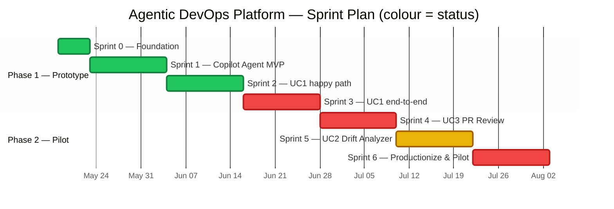
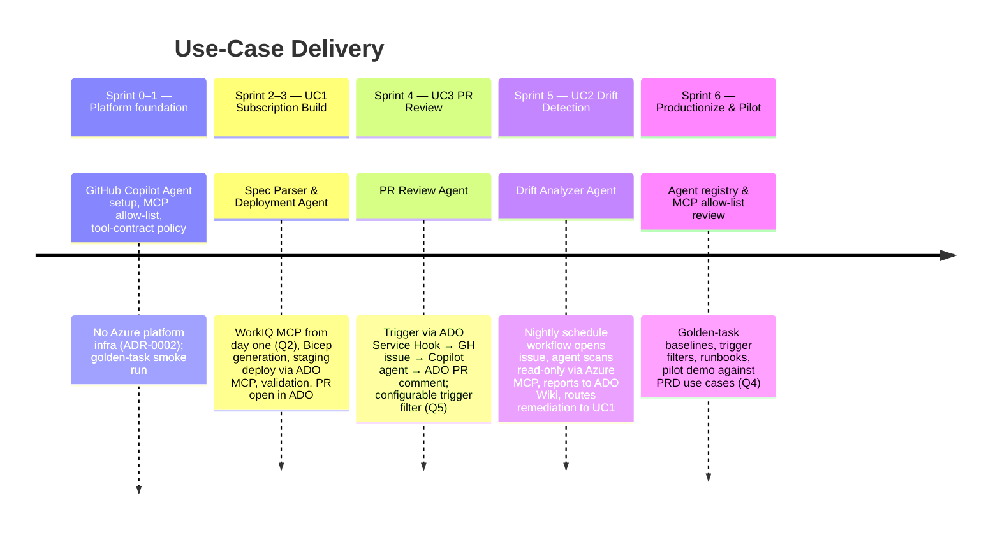
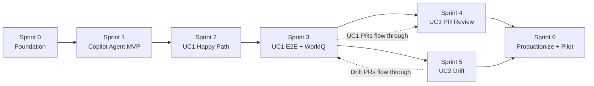

# Sprint Plan — Implementing the Agentic DevOps Platform

| Field | Value |
|-------|-------|
| **Version** | 2.1.0 |
| **Date** | 2026-05-18 |
| **Author** | Urs Rüegg |
| **Status** | Draft |
| **Previous Version** | 2.0.0 (reversed Python/Foundry runtime per ADR-0002); 2.0.1 PATCH — fixed Mermaid timeline section-heading parser crash; 2.1.0 MINOR — encode sprint **status** (🟢 finished / 🟡 in progress / 🔴 open) as colours in the §3 Gantt and add a colour legend. Status as of 2026-05-18: S0/S1/S2 finished, S5 in progress (MVP shipped per AGENTS.md 1.3.0; nightly scheduler, tracked-subscription registry, runbook, WorkIQ MCP deferred), S3/S4/S6 open. Critical-path information is unchanged and remains in §4 prose. |

> **Purpose**: Sequencing proposal for the seven sprints that take the Agentic
> DevOps Platform from an empty repo to a pilot-ready solution covering all
> three use cases (UC1, UC2, UC3) defined in
> [docs/SOLUTION_OVERVIEW.md](../docs/SOLUTION_OVERVIEW.md).
>
> **Runtime**: Per [ADR-0002](../docs/adr/0002-runtime-is-github-copilot-coding-agent.md),
> every agent in this plan is realised as a **GitHub Copilot coding agent**
> configured by repository assets (AGENTS.md, prompt files, `.github/copilot/`,
> issue templates, MCP server allow-list, golden-task fixtures). There is **no
> bespoke Python runtime, no Foundry-hosted agent, and no platform-runtime
> Azure infrastructure** delivered by these sprints. Bicep modules produced by
> UC1 are *outputs* of the agent, not infrastructure that hosts the agent.

---

## Table of Contents

1. [Approach](#1-approach)
2. [Sequencing Rationale](#2-sequencing-rationale)
3. [Timeline](#3-timeline)
4. [Dependency Graph](#4-dependency-graph)
5. [Milestones & Phase Mapping](#5-milestones--phase-mapping)
6. [Resourcing & Roles](#6-resourcing--roles)
7. [Success Metrics](#7-success-metrics)
8. [Risks](#8-risks)
9. [Open Questions — Resolutions](#9-open-questions--resolutions)
10. [Related Documents](#10-related-documents)

---

## 1. Approach

The plan follows four principles:

1. **Governance from sprint 0** — repo conventions, GitHub Copilot coding-agent
   configuration (`AGENTS.md`, `.github/copilot-instructions.md`,
   `.github/copilot/mcp.json`), issue/PR templates, ADR system, and the
   security model for MCP-mediated access to ADO/Azure land before any
   agent prompts are exercised end-to-end. This prevents retrofitting
   security later.
2. **Vertical slices per use case** — each use case is implemented as a thin
   end-to-end slice first (happy path), then hardened in a follow-up sprint.
   This produces a demonstrable agent run (issue → PR → merged change) at
   the end of every sprint.
3. **Use cases sequenced by dependency** —
   UC1 (build) ⇒ UC3 (review the PRs UC1 produces) ⇒ UC2 (compare reality
   against the spec UC1 owns).
   UC1 first because UC2 has nothing to compare against without it, and UC3
   gives us a fast win that benefits *every* PR that follows.
4. **Pilot-ready at sprint 6** — production controls (agent registry,
   trigger configuration, golden-task eval baselines, runbooks, MCP
   allow-list review) close out before pilot onboarding, satisfying Phase 2
   exit criteria in the
   [roadmap](../docs/SOLUTION_OVERVIEW.md#8-phased-roadmap).

---

## 2. Sequencing Rationale

| Sprint | Why now? |
|--------|----------|
| **0 — Foundation** | Repo skeleton, **GitHub Copilot coding-agent setup** (`AGENTS.md`, refined `.github/copilot-instructions.md`, PR template, ISSUE_TEMPLATE/, `.github/copilot/mcp.json` allow-list, CODEOWNERS, lightweight CI for markdown + Bicep validate), ADR system. **No Azure resources provisioned** — the platform itself does not run on Azure (per [ADR-0002](../docs/adr/0002-runtime-is-github-copilot-coding-agent.md)). |
| **1 — Copilot Coding Agent MVP** | Stand the agent up end-to-end as a Copilot coding agent: define the first agent in `agents/orchestrator/` (Markdown prompt + sub-agent dispatch rules), wire MCP servers (Azure MCP + GitHub MCP first), establish the **tool-contract / side-effect / confirm policy** in `AGENTS.md`, run a smoke issue → PR roundtrip with a golden-task fixture. Reused by every specialized agent in S2–S6. |
| **2 — UC1 Happy Path** | First vertical slice of UC1. Per [§9 Q2](#9-open-questions--resolutions) the spec is read through **WorkIQ MCP from day one**. Sprint focuses on the WorkIQ MCP integration pattern (auth, tool contracts, schema validation), Bicep parameter generation as repository templates, and a staging deployment trigger via ADO MCP. |
| **3 — UC1 End-to-End** | Adds Azure Policy enforcement on staging, ADO PR opening via Azure DevOps MCP (write path), OBO authentication for human-triggered runs, federated-credential identity for autonomous runs, and full golden-task suite for UC1. Closes Phase 1 (Prototype) — UC1 is feature-complete. |
| **4 — UC3 PR Review Agent** | UC3 is the simplest of the three (read PR, comment) and benefits *every* future PR — including the PRs UC1 produces. Done before UC2 because the work-item-scope and policy-check prompt patterns it pioneers are reusable in UC2 and any future agent. Trigger arrives via ADO Service Hook → GitHub issue → Copilot coding agent. |
| **5 — UC2 Drift Analyzer** | UC2 depends on UC1: it diffs the live subscription against the spec that UC1 manages. Doing it after UC1 stabilises and after UC3 is in place means drift-driven PRs also flow through UC3 — full virtuous cycle. Nightly trigger is a GitHub Actions `schedule` workflow that files an issue the Copilot coding agent picks up. |
| **6 — Productionize & Pilot** | Productionization (agent registry as `AGENTS.md` table + per-agent prompt registry, trigger filter configuration, golden-task baselines, MCP allow-list quarterly review, runbooks) is a single dedicated sprint so it isn't half-done in each functional sprint. Per [§9 Q4](#9-open-questions--resolutions) pilot work demonstrates the platform against the **shared use cases in the [PRD](../docs/PRD.md)**, not a specific BU. |

---

## 3. Timeline

> **Colour legend** (status as of the document **Date** above; critical-path
> information is captured separately in [§4](#4-dependency-graph)):
>
> - 🟢 **Finished** — sprint exit criteria met; tracked artefacts merged.
> - 🟡 **In progress** — sprint started; some scope shipped, deferrals remain.
> - 🔴 **Open** — not started.

---

## 4. Dependency Graph

Critical path: `S0 → S1 → S2 → S3 → S5 → S6` (longest chain).
S4 (UC3) can run partly in parallel with S5 if a second team member is
available; the plan above keeps them sequential for one-team delivery.

---

## 5. Milestones & Phase Mapping

| Milestone | Sprint | Roadmap Phase | Demoable Outcome |
|-----------|--------|---------------|------------------|
| **M1** — Foundation green | End of S0 | Phase 1 | Repo, `AGENTS.md`, refined `.github/copilot-instructions.md`, ISSUE_TEMPLATE/, MCP allow-list, CI (markdown lint + Bicep validate); **no Azure platform infrastructure** (per [ADR-0002](../docs/adr/0002-runtime-is-github-copilot-coding-agent.md)). |
| **M2** — Copilot agent MVP | End of S1 | Phase 1 | A Copilot coding agent invoked from a smoke issue calls one MCP tool, opens a draft PR with the result, and the golden-task fixture passes. |
| **M3** — UC1 happy path demo | End of S2 | Phase 1 | WorkIQ MCP fetches spec → Copilot agent generates Bicep params → triggers staging deploy via ADO MCP → validation report posted to the PR. |
| **M4** — UC1 production-ready | End of S3 | Phase 1 ✅ | WorkIQ spec → full UC1 cycle → PR opened in ADO with audit trace (GitHub issue/PR thread + ADO PR + audit log). |
| **M5** — UC3 live | End of S4 | Phase 2 | New PR in ADO fires Service Hook → GitHub issue → Copilot agent posts review comment back to ADO PR within 60 s p95. Trigger filter configurable per [§9 Q5](#9-open-questions--resolutions). |
| **M6** — UC2 live | End of S5 | Phase 2 | GitHub Actions `schedule` opens a drift-scan issue → Copilot agent scans read-only via Azure MCP → drift report routed to UC1 via ADO Wiki + new UC1 invocation. |
| **M7** — Pilot-ready | End of S6 | Phase 2 ✅ | Platform demonstrated end-to-end against PRD use cases (UC1/UC2/UC3); agent registry (AGENTS.md), trigger filters, golden-task baselines, MCP allow-list reviewed, runbooks published. |

---

## 6. Resourcing & Roles

| Role | Responsibility |
|------|----------------|
| **Platform engineer** | Repo conventions, MCP allow-list, CODEOWNERS, OIDC for any Azure-touching workflows, Bicep templates for UC1 outputs (lead S0, S1, S6). |
| **Agent engineer** | Agent prompt definitions in `agents/`, `AGENTS.md` orchestration rules, tool contracts, golden-task fixtures (lead S2–S5). |
| **Security/identity reviewer** | Reviews MCP allow-list, federated-credential design for UC1 deployments, RBAC scopes for read/write/deploy tools (consulted S0, S6; signs off S6). |
| **Solution architect (user)** | Owns spec authoring in WorkIQ, approves UC1 deployments, reviews UC3 outputs (consulted every sprint; user-tests S3+). |
| **Pilot demo coordinator** | Curates the PRD-driven pilot scenarios used in Sprint 6 (per [§9 Q4](#9-open-questions--resolutions)). |

Minimum viable team: 1 platform engineer + 1 agent engineer + part-time security review.

---

## 7. Success Metrics

Per [docs/SOLUTION_OVERVIEW.md §7](../docs/SOLUTION_OVERVIEW.md#7-key-risks--mitigations)
the platform's success is measured by:

| Metric | Target by end of plan |
|--------|------------------------|
| **UC1 time-to-deploy** (spec → staging deployed + validated) | < 15 min for a standard landing zone |
| **UC3 PR review latency** (PR opened in ADO → agent comment posted on ADO PR) | < 60 s p95 |
| **UC2 drift coverage** | 100 % of pilot subscriptions scanned daily, 0 silent drift older than 24 h |
| **Eval pass rate** | ≥ 95 % on golden-task fixtures per agent before merge to `main` |
| **Audit completeness** | 100 % of agent actions traceable across GitHub (issue/PR/audit log) and ADO/Azure (MCP-side audit) with acting identity |
| **Bicep coverage** (for UC1 output templates) | ≥ 80 % of changed `.bicep` lines validated by `iac-validate.yml` |

---

## 8. Risks

| Risk | Impact | Mitigation | Sprint |
|------|--------|------------|--------|
| ADO MCP / WorkIQ MCP / Azure MCP / GitHub MCP behavior changes during build | Medium | Pin MCP server versions in `.github/copilot/mcp.json`; record observed API in ADRs; isolate MCP-specific guidance per agent prompt. | S1, S3 |
| GitHub Copilot coding-agent rate limits or feature regressions stall a use case | High | Track agent throughput as a repo metric (issue → PR cycle time); design agents as Markdown prompt files + MCP server configs so they can be lifted to another runtime (Foundry, custom) without rewriting business logic. See [ADR-0002](../docs/adr/0002-runtime-is-github-copilot-coding-agent.md) R1. | All |
| Staging subscription quota or policy blocks UC1 demo | Medium | Reserve quota early; coordinate with Azure subscription owner before S2. | S2 |
| Golden-task fixtures too noisy → blocks merges | Medium | Start with one smoke fixture in S1; ramp coverage in S3+ when patterns are stable. | S1, S3 |
| Sensitive operations (deploy/delete) executed without human confirmation | High | `AGENTS.md` enforces side-effect taxonomy and the deploy/delete-requires-human-confirm rule; PR template demands explicit confirmation evidence; reinforced in per-agent prompts. See [ADR-0002](../docs/adr/0002-runtime-is-github-copilot-coding-agent.md) R2. | S1+ |
| MCP allow-list drift introduces unintended capabilities | Medium | `.github/copilot/mcp.json` is checked in; quarterly review in S6; CODEOWNERS gate on changes. See [ADR-0002](../docs/adr/0002-runtime-is-github-copilot-coding-agent.md) R3. | S0, S6 |

---

## 9. Open Questions — Resolutions

> Status as of 2026-05-18. Decisions captured here so the team can move on with
> Sprint 0. Anything that later requires an architectural commitment must still
> be promoted to an ADR under [docs/adr/](../docs/adr/).

| # | Question | Decision (2026-05-18) | Implication |
|---|----------|------------------------|-------------|
| Q1 | Which Azure subscription will host `dev` / `test` / `prod` Cosmos DB and Key Vault? *(Need by S0.)* | **Superseded by [ADR-0002](../docs/adr/0002-runtime-is-github-copilot-coding-agent.md).** The platform runtime is GitHub Copilot coding agent — no platform-runtime Cosmos DB / Key Vault is provisioned by this plan. Azure subscriptions enter the picture only as *targets* the agents act upon (UC1 staging/prod, UC2 scanned subscriptions); those targets are owned by the customer, not by this repo. | No platform Cosmos DB / Key Vault provisioning. The original 2026-05-18 decision to keep it "subscription-independent for sprint 0" is now permanent for the platform itself. |
| Q2 | Spec format: Excel/SharePoint, or YAML/JSON in Git? *(Decision by end of S2 — ADR.)* | **Stay on WorkIQ MCP.** The spec is read through the **WorkIQ MCP server**; we do not migrate the spec source. Sprint 2 focuses on **how the GitHub Copilot coding agent connects to WorkIQ MCP**. | No spec-format migration. UC1 sprints invest in the WorkIQ MCP integration pattern (auth, tool contracts, schema validation, fallback). ADR will document the MCP integration, not a format change. |
| Q3 | LLM model choice (Azure OpenAI deployment, region, capacity)? *(Decision by S1.)* | **Superseded by [ADR-0002](../docs/adr/0002-runtime-is-github-copilot-coding-agent.md).** The model is whatever GitHub Copilot uses at runtime; the platform does not select, deploy, or manage a model. The previous "model-independent / provider abstraction" decision no longer applies at the platform-runtime layer. The provider-abstraction guidance is retained in [docs/AI.md §2.1](../docs/AI.md#21-model-provider-abstraction-not-applicable-at-runtime) as a forward-looking note for any future code introduced by a use case. | No model deployment, no provider package, no model-name pinning in evals. Eval fixtures assert *capabilities* and *outputs*, not models. |
| Q4 | Which BU pilots? *(Decision by S4.)* | **No specific BU.** Focus on the **shared use cases described in the [PRD](../docs/PRD.md)** (UC1, UC2, UC3) rather than a single BU's workload. | Pilot work in S6 demonstrates the platform against representative use cases from the PRD; BU-specific onboarding is out of scope for this plan. |
| Q5 | Does UC3 run on every PR, or only PRs touching `infra/**`? *(Decision by S4.)* | **Discover with the customer later.** Defer the scope filter; design UC3 so the trigger filter is **configurable** (default: every PR; opt-in path-filter via repo config). | Sprint 4 ships UC3 with a configurable trigger filter and documents both modes; final default is set during pilot conversations. |

> All five items above are now considered **decided for planning purposes**.
> If a decision is reversed or refined, update the row, link to the ADR that
> supersedes it, and bump the document version.

---

## 10. Related Documents

- [sprints/README.md](./README.md) — sprint index and conventions
- [sprints/sprint-00-foundation.md](./sprint-00-foundation.md)
- [sprints/sprint-01-orchestrator-mvp.md](./sprint-01-orchestrator-mvp.md)
- [sprints/sprint-02-uc1-spec-parser-happy-path.md](./sprint-02-uc1-spec-parser-happy-path.md)
- [sprints/sprint-03-uc1-end-to-end.md](./sprint-03-uc1-end-to-end.md)
- [sprints/sprint-04-uc3-pr-review-agent.md](./sprint-04-uc3-pr-review-agent.md)
- [sprints/sprint-05-uc2-drift-analyzer.md](./sprint-05-uc2-drift-analyzer.md)
- [sprints/sprint-06-productionize-and-pilot.md](./sprint-06-productionize-and-pilot.md)
- [docs/SOLUTION_OVERVIEW.md](../docs/SOLUTION_OVERVIEW.md)
- [docs/ALM_PLAN.md](../docs/ALM_PLAN.md)
