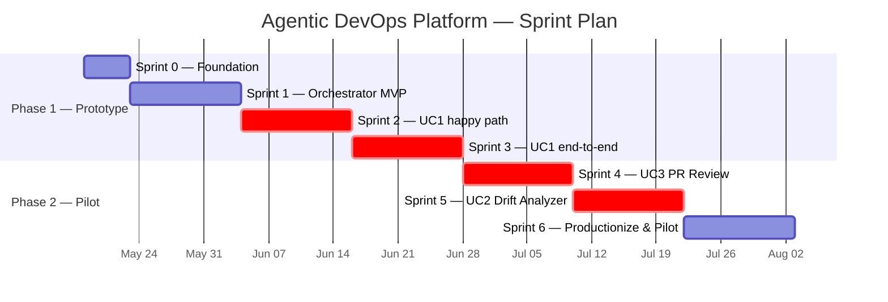
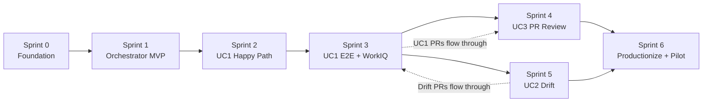

# Sprint Plan — Implementing the Agentic DevOps Platform

| Field | Value |
|-------|-------|
| **Version** | 1.0 |
| **Date** | 2026-05-18 |
| **Author** | Urs Rüegg |
| **Status** | Draft |
| **Previous Version** | — (initial release) |

> **Purpose**: Sequencing proposal for the seven sprints that take the Agentic
> DevOps Platform from an empty repo to a pilot-ready solution covering all
> three use cases (UC1, UC2, UC3) defined in
> [docs/SOLUTION_OVERVIEW.md](../docs/SOLUTION_OVERVIEW.md).

---

## Table of Contents

1. [Approach](#1-approach)
2. [Sequencing Rationale](#2-sequencing-rationale)
3. [Timeline](#3-timeline)
4. [Dependency Graph](#4-dependency-graph)
5. [Milestones & Phase Mapping](#5-milestones--phase-mapping)
6. [Resourcing & Roles](#6-resourcing--roles)
7. [Success Metrics](#7-success-metrics)
8. [Risks](#8-risks)
9. [Open Questions — Resolutions](#9-open-questions--resolutions)
10. [Related Documents](#10-related-documents)

---

## 1. Approach

The plan follows four principles:

1. **Governance from sprint 0** — identity, secrets, observability, OIDC, and
   IaC scaffolding land before any agent code. This prevents retrofitting
   security later and ensures every demo is representative of the final
   architecture.
2. **Vertical slices per use case** — each use case is implemented as a thin
   end-to-end slice first (happy path), then hardened in a follow-up sprint.
   This produces a demonstrable agent at the end of every sprint instead of
   waiting until the end.
3. **Use cases sequenced by dependency** —
   UC1 (build) ⇒ UC3 (review the PRs UC1 produces) ⇒ UC2 (compare reality
   against the spec UC1 owns).
   UC1 first because UC2 has nothing to compare against without it, and UC3
   gives us a fast win that benefits *every* PR that follows.
4. **Pilot-ready at sprint 6** — production controls (Conditional Access,
   Agent 365 telemetry, SLOs, runbooks) close out before pilot onboarding,
   satisfying Phase 2 exit criteria in the
   [roadmap](../docs/SOLUTION_OVERVIEW.md#8-phased-roadmap).

---

## 2. Sequencing Rationale

| Sprint | Why now? |
|--------|----------|
| **0 — Foundation** | Repo, IaC scaffold, Entra app registrations, OIDC, Key Vault, Cosmos DB, Log Analytics, App Insights, GitHub Actions skeleton, ADR system. Every later sprint depends on this — it must come first. |
| **1 — Orchestrator MVP** | Agent framework, tool-contract schema, tracing, and eval harness scaffolding are reused by every specialized agent. Building them once avoids three parallel forks. |
| **2 — UC1 Happy Path** | UC1 has the most moving parts (spec → Bicep → pipeline → validation). Splitting it across two sprints (2 and 3) reduces risk and gives a working demo in 4 weeks. JSON spec defers WorkIQ complexity. |
| **3 — UC1 End-to-End** | Adds WorkIQ (SharePoint spec), Azure Policy, ADO PR opening, and full eval harness for UC1. Closes Phase 1 (Prototype) — UC1 is feature-complete. |
| **4 — UC3 PR Review Agent** | UC3 is the simplest of the three (read PR, comment) and benefits *every* future PR — including the PRs UC1 produces. Done before UC2 because the work-item-scope and policy-check patterns it pioneers are reusable in UC2 and any future agent. |
| **5 — UC2 Drift Analyzer** | UC2 depends on UC1: it diffs the live subscription against the spec that UC1 manages. Doing it after UC1 stabilises and after UC3 is in place means drift-driven PRs also flow through UC3 — full virtuous cycle. |
| **6 — Productionize & Pilot** | Productionization (registry, Conditional Access, Agent 365, SLOs, continuous eval, runbooks) is a single dedicated sprint so it isn't half-done in each functional sprint. Pilot BU onboarding starts at the end. |

---

## 3. Timeline



```mermaid
timeline
    title Use-Case Delivery
    section Sprint 0–1 : Platform foundation
        Identity, IaC, observability, agent framework : No agent yet, but everything later depends on it
    section Sprint 2–3 : UC1 — Subscription Build
        Spec Parser & Deployment Agent : Bicep generation, staging deploy, validation, PR open
    section Sprint 4 : UC3 — PR Review
        PR Review Agent : Summary, policy check, work-item scope check, structured comment
    section Sprint 5 : UC2 — Drift Detection
        Drift Analyzer Agent : Read-only scan, gap report, route to UC1 for remediation
    section Sprint 6 : Productionize & Pilot
        Agent registry & Conditional Access : Agent 365 telemetry, SLOs, runbooks, BU onboarding
```

---

## 4. Dependency Graph



Critical path: `S0 → S1 → S2 → S3 → S5 → S6` (longest chain).
S4 (UC3) can run partly in parallel with S5 if a second team member is
available; the plan above keeps them sequential for one-team delivery.

---

## 5. Milestones & Phase Mapping

| Milestone | Sprint | Roadmap Phase | Demoable Outcome |
|-----------|--------|---------------|------------------|
| **M1** — Platform foundation green | End of S0 | Phase 1 | `azd up` provisions Key Vault, Cosmos DB, App Insights; CI green. |
| **M2** — Orchestrator + first tool call | End of S1 | Phase 1 | Orchestrator agent receives prompt, calls a stub tool, persists trace. |
| **M3** — UC1 happy path demo | End of S2 | Phase 1 | JSON spec → Bicep → staging deploy → validation report. |
| **M4** — UC1 production-ready | End of S3 | Phase 1 ✅ | SharePoint spec → full UC1 cycle → PR opened in ADO with audit trace. |
| **M5** — UC3 live | End of S4 | Phase 2 | New PR in ADO triggers agent → review comment posted within 60 s. |
| **M6** — UC2 live | End of S5 | Phase 2 | Nightly drift scan → drift report → routed back through UC1. |
| **M7** — Pilot kickoff | End of S6 | Phase 2 ✅ | One pilot BU onboarded; agent registry, Conditional Access, SLOs in production. |

---

## 6. Resourcing & Roles

| Role | Responsibility |
|------|----------------|
| **Platform engineer** | IaC, OIDC, identity, observability, agent framework plumbing (lead S0, S1, S6). |
| **Agent engineer** | Agent logic, prompts, tool implementations, evals (lead S2–S5). |
| **Security/identity reviewer** | Reviews Entra Agent ID design, Conditional Access, RBAC scopes (consulted S0, S6; signs off S6). |
| **Solution architect (user)** | Owns spec format, approves UC1 deployments, reviews UC3 outputs (consulted every sprint; user-tests S3+). |
| **Pilot BU sponsor** | Provides workload + sandbox subscription for Sprint 6 onboarding. |

Minimum viable team: 1 platform engineer + 1 agent engineer + part-time security review.

---

## 7. Success Metrics

Per [docs/SOLUTION_OVERVIEW.md §7](../docs/SOLUTION_OVERVIEW.md#7-key-risks--mitigations)
the platform's success is measured by:

| Metric | Target by end of plan |
|--------|------------------------|
| **UC1 time-to-deploy** (spec → staging deployed + validated) | < 15 min for a standard landing zone |
| **UC3 PR review latency** (PR opened → agent comment posted) | < 60 s p95 |
| **UC2 drift coverage** | 100 % of pilot subscriptions scanned daily, 0 silent drift older than 24 h |
| **Eval pass rate** | ≥ 95 % on golden tasks per agent before merge to `main` |
| **Audit completeness** | 100 % of agent actions traceable in App Insights + ADO with acting identity |
| **Coverage** | ≥ 80 % on changed files in every PR |

---

## 8. Risks

| Risk | Impact | Mitigation | Sprint |
|------|--------|------------|--------|
| ADO MCP / WorkIQ MCP behavior changes during build | Medium | Pin MCP versions; abstract behind internal tool contracts; record observed API in ADRs. | S1, S3 |
| Entra Agent ID feature gaps in pilot tenant | High | Validate in S0; have OBO + SP fallback patterns documented. | S0, S6 |
| Staging subscription quota or policy blocks demo | Medium | Reserve quota early; coordinate with Azure subscription owner before S2. | S2 |
| Eval harness too noisy → blocks merges | Medium | Start with smoke evals only in S1; ramp coverage in S3+ when patterns are stable. | S1, S3 |
| Pilot BU not ready by S6 | Medium | Identify BU sponsor in S0; ensure success criteria are agreed by S4. | S0, S6 |

---

## 9. Open Questions — Resolutions

> Status as of 2026-05-18. Decisions captured here so the team can move on with
> Sprint 0. Anything that later requires an architectural commitment must still
> be promoted to an ADR under [docs/adr/](../docs/adr/).

| # | Question | Decision (2026-05-18) | Implication |
|---|----------|------------------------|-------------|
| Q1 | Which Azure subscription will host `dev` / `test` / `prod` Cosmos DB and Key Vault? *(Need by S0.)* | **Defer.** Keep the implementation **subscription-independent** for the first sprint so we can target different deployment targets later. Sprint 0 focuses on the **GitHub Copilot Agent implementation**, not on hosting infrastructure. | Sprint 0 will not provision Cosmos DB / Key Vault yet; any persistence in S0–S1 is local or in-memory behind an interface. Subscription decision is re-opened when the platform actually needs durable state. |
| Q2 | Spec format: Excel/SharePoint, or YAML/JSON in Git? *(Decision by end of S2 — ADR.)* | **Stay on WorkIQ MCP.** The spec is read through the **WorkIQ MCP server (tools/connector)**; we do not migrate the spec source. Sprint 2 focuses on **how the GitHub Copilot Agent connects to WorkIQ MCP**. | No spec-format migration. UC1 sprints invest in the WorkIQ MCP integration pattern (auth, tool contracts, schema validation, fallback). ADR will document the MCP integration, not a format change. |
| Q3 | LLM model choice (Azure OpenAI deployment, region, capacity)? *(Decision by S1.)* | **Model-independent.** We do not pick a specific model yet. The agent layer must abstract the model behind a provider interface so we can swap it later. | `docs/AI.md` and the agent framework must keep a model-provider abstraction. Evals are written against capabilities, not a specific model name. Model choice deferred until pilot scale needs are known. |
| Q4 | Which BU pilots? *(Decision by S4.)* | **No specific BU.** Focus on the **shared use cases described in the [PRD](../docs/PRD.md)** (UC1, UC2, UC3) rather than a single BU's workload. | Pilot work in S6 demonstrates the platform against representative use cases from the PRD; BU-specific onboarding is out of scope for this plan. |
| Q5 | Does UC3 run on every PR, or only PRs touching `infra/**`? *(Decision by S4.)* | **Discover with the customer later.** Defer the scope filter; design UC3 so the trigger filter is **configurable** (default: every PR; opt-in path-filter via repo config). | Sprint 4 ships UC3 with a configurable trigger filter and documents both modes; final default is set during pilot conversations. |

> All five items above are now considered **decided for planning purposes**.
> If a decision is reversed or refined, update the row, link to the ADR that
> supersedes it, and bump the document version.

---

## 10. Related Documents

- [sprints/README.md](./README.md) — sprint index and conventions
- [sprints/sprint-00-foundation.md](./sprint-00-foundation.md)
- [sprints/sprint-01-orchestrator-mvp.md](./sprint-01-orchestrator-mvp.md)
- [sprints/sprint-02-uc1-spec-parser-happy-path.md](./sprint-02-uc1-spec-parser-happy-path.md)
- [sprints/sprint-03-uc1-end-to-end.md](./sprint-03-uc1-end-to-end.md)
- [sprints/sprint-04-uc3-pr-review-agent.md](./sprint-04-uc3-pr-review-agent.md)
- [sprints/sprint-05-uc2-drift-analyzer.md](./sprint-05-uc2-drift-analyzer.md)
- [sprints/sprint-06-productionize-and-pilot.md](./sprint-06-productionize-and-pilot.md)
- [docs/SOLUTION_OVERVIEW.md](../docs/SOLUTION_OVERVIEW.md)
- [docs/ALM_PLAN.md](../docs/ALM_PLAN.md)
