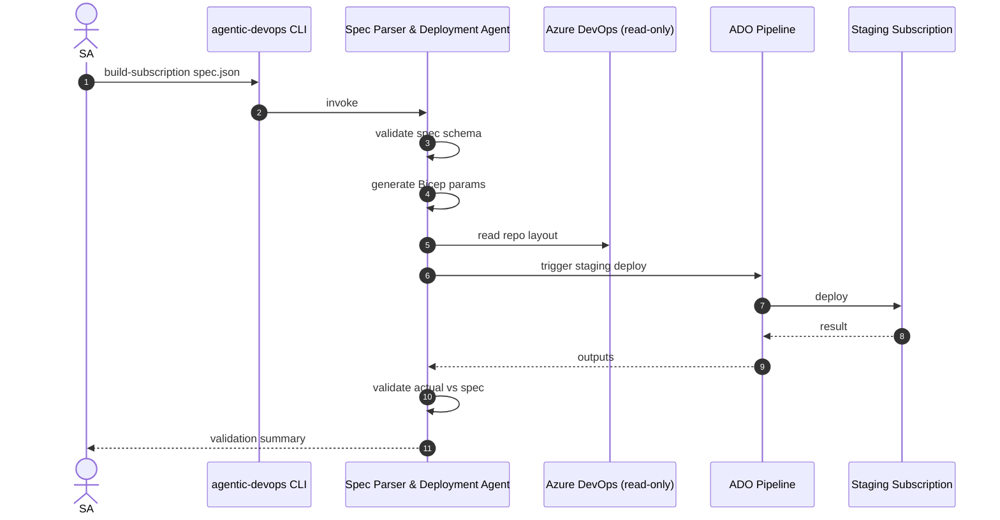

# Sprint 2 — UC1 Spec Parser & Deployment Agent (Happy Path)

| Field | Value |
|-------|-------|
| **Version** | 1.0 |
| **Date** | 2026-05-18 |
| **Author** | Urs Rüegg |
| **Status** | Draft |
| **Previous Version** | — (initial release) |

> **Window**: 2026-06-08 → 2026-06-19 (2 weeks)
> **Theme**: First vertical slice of **UC1** — JSON spec ⇒ Bicep parameters ⇒
> staging deployment ⇒ validation report. ADO MCP read-only first; PR opening
> deferred to Sprint 3.

---

## Table of Contents

1. [Goal & Outcomes](#1-goal--outcomes)
2. [Use Cases Addressed](#2-use-cases-addressed)
3. [Scope](#3-scope)
4. [User Stories & Acceptance Criteria](#4-user-stories--acceptance-criteria)
5. [Deliverables](#5-deliverables)
6. [Dependencies](#6-dependencies)
7. [Risks & Mitigations](#7-risks--mitigations)
8. [Exit Criteria](#8-exit-criteria)
9. [Demo Script](#9-demo-script)
10. [Related Documents](#10-related-documents)

---

## 1. Goal & Outcomes

Prove the **happy path** of UC1: an SA hands the agent a JSON spec, the agent
generates Bicep parameter files, triggers a staging deployment, and produces a
validation summary comparing the deployed state against the spec.

End-of-sprint capability:

```
agentic-devops build-subscription ./samples/landing-zone-spec.json
```

→ branch + commits created locally, staging deployed in `rg-agentic-devops-stg-<short-id>`,
validation report printed and persisted, trace in Cosmos DB.

---

## 2. Use Cases Addressed

- **UC1 — Initial Azure Subscription Build** (happy path)



---

## 3. Scope

### In Scope
- JSON spec schema (`schemas/landing-zone-spec.schema.json`): network ranges, resource list, tags, naming.
- Spec validator tool (`tools/spec_validator.py`).
- Bicep parameter generator (`tools/bicep_param_gen.py`) — Jinja2 templates → `.bicepparam`.
- ADO MCP integration (**read-only**): list repos, read files.
- ADO pipeline trigger tool (`tools/ado_pipeline_run.py`) calling existing IaC pipeline (or a stub pipeline shipped with this sprint).
- Validation tool (`tools/azure_state_diff.py`) — reads RG resources via Azure SDK and diffs against spec.
- Spec Parser & Deployment Agent (`agents/spec_parser/`) using Sprint 1's runtime.
- Sample spec + sample target Bicep (`samples/landing-zone-spec.json`, `infra/landing-zone/`).
- Evals: 3 golden tasks (well-formed spec, missing required field, naming-policy violation).

### Out of Scope
- WorkIQ / SharePoint spec ingestion (Sprint 3).
- Opening a PR in ADO (Sprint 3).
- Azure Policy enforcement on staging (Sprint 3).
- Excel spec ingestion (Sprint 3).
- Multi-region / multi-subscription specs (later).

---

## 4. User Stories & Acceptance Criteria

### S2-1 — Spec schema + validator
**As an** SA
**I want** a strict spec schema with clear validation errors
**so that** I can author specs confidently.

**Acceptance**:
- [ ] JSON Schema for landing-zone spec checked into `schemas/`.
- [ ] Validator rejects missing required fields with a path-pointing error (`/network/vnetCidr`).
- [ ] Validator enforces naming rules (regex per resource type) and required tags.
- [ ] Unit tests cover 5+ malformed specs.

### S2-2 — Bicep parameter generation
**As an** agent
**I want** to deterministically generate `.bicepparam` files from a spec
**so that** the IaC pipeline can deploy without manual editing.

**Acceptance**:
- [ ] Generated files build clean with `az bicep build-params`.
- [ ] Generation is deterministic (same spec → byte-identical output).
- [ ] Output organized as `infra/landing-zone/parameters/<env>.bicepparam`.
- [ ] Naming + tagging conventions match `.github/copilot-instructions.md` §8.

### S2-3 — ADO MCP read-only integration
**As an** agent
**I want** to read repo structure from ADO via MCP
**so that** I can place files in the correct repo path.

**Acceptance**:
- [ ] ADO MCP authenticated via Entra Agent ID.
- [ ] Agent lists repos, reads `README.md` from a target repo.
- [ ] Tool side-effect class is `read`; no write paths exposed yet.

### S2-4 — Staging deployment trigger
**As an** agent
**I want** to trigger a staging deployment pipeline and wait for completion
**so that** validation can run against deployed reality.

**Acceptance**:
- [ ] `ado_pipeline_run` tool starts an ADO pipeline run with parameters, returns run ID.
- [ ] Agent polls until completion (max 30 min, configurable).
- [ ] Tool side-effect class is `deploy`; requires `confirm=True`.
- [ ] On success, RG `rg-agentic-devops-stg-<runId>` contains expected resources.

### S2-5 — Validation: actual vs spec
**As an** SA
**I want** a structured report of any mismatch between spec and deployed state
**so that** I can decide to proceed, fix the spec, or fail the run.

**Acceptance**:
- [ ] `azure_state_diff` enumerates resources in the staging RG and compares each to the spec.
- [ ] Mismatches reported as a structured list: `{path, expected, actual, severity}`.
- [ ] Report persisted as a Cosmos DB document (`validation-reports` container, partition `/agentRunId`).
- [ ] Agent's final CLI output shows pass/fail + first 10 mismatches.

### S2-6 — Evals for UC1 happy path
**Acceptance**:
- [ ] 3 golden tasks in `evals/tasks/uc1/`: happy path, missing tag, invalid VNET CIDR.
- [ ] CI eval pass rate ≥ 95 % (3/3 expected).

---

## 5. Deliverables

| Artifact | Path |
|----------|------|
| Spec schema | `schemas/landing-zone-spec.schema.json` |
| Spec Parser Agent | `agents/spec_parser/` |
| Tools | `tools/spec_validator.py`, `tools/bicep_param_gen.py`, `tools/ado_mcp.py`, `tools/ado_pipeline_run.py`, `tools/azure_state_diff.py` |
| Sample spec | `samples/landing-zone-spec.json` |
| Target IaC | `infra/landing-zone/` (Bicep templates + sample pipeline) |
| Evals | `evals/tasks/uc1/*.yaml` |

---

## 6. Dependencies

- Sprint 1 runtime, tool framework, tracing.
- ADO organization with a project + repo for landing-zone IaC.
- Entra Agent ID granted: `Contributor` on `rg-agentic-devops-stg-*`, `Build (read)` + `Build (queue)` on ADO project.
- Sample landing-zone Bicep templates (either pre-existing or built in this sprint as a thin sample).

---

## 7. Risks & Mitigations

| Risk | Mitigation |
|------|------------|
| ADO pipeline doesn't exist yet for landing zone | Ship a thin sample pipeline (`infra/landing-zone/pipelines/deploy.yml`) as part of this sprint. |
| Staging subscription quota blocks deploy | Pre-validate with `what-if`; reserve quota; use small SKUs in samples. |
| Spec ambiguity → flaky validation | Keep spec strict (no optional ambiguous fields); document every field in the schema. |
| ADO MCP write semantics differ from expectations | Stay read-only this sprint; defer write to Sprint 3 with explicit ADR. |

---

## 8. Exit Criteria

- [ ] All user stories done.
- [ ] M3 demo executed.
- [ ] Evals green; coverage ≥ 80 % on changed files.
- [ ] Validation report persisted and replayable from Cosmos DB.

---

## 9. Demo Script (M3)

1. Show the JSON spec (`samples/landing-zone-spec.json`).
2. Run `agentic-devops build-subscription samples/landing-zone-spec.json --confirm`.
3. Show generated `.bicepparam` files (deterministic, lint-clean).
4. Show the ADO pipeline run triggered by the agent — green.
5. Show the staging RG in Azure portal — resources tagged and named per spec.
6. Show the validation report (CLI + Cosmos DB document).
7. Show App Insights end-to-end trace (plan → tools → deploy → diff).

---

## 10. Related Documents

- [sprints/SPRINT_PLAN.md](./SPRINT_PLAN.md)
- [sprints/sprint-03-uc1-end-to-end.md](./sprint-03-uc1-end-to-end.md)
- [docs/SOLUTION_OVERVIEW.md §5.1](../docs/SOLUTION_OVERVIEW.md#51-use-case-1--initial-azure-subscription-build-landing-zone-provisioning)
- [docs/INFRASTRUCTURE.md](../docs/INFRASTRUCTURE.md)
- [docs/AI.md](../docs/AI.md)
