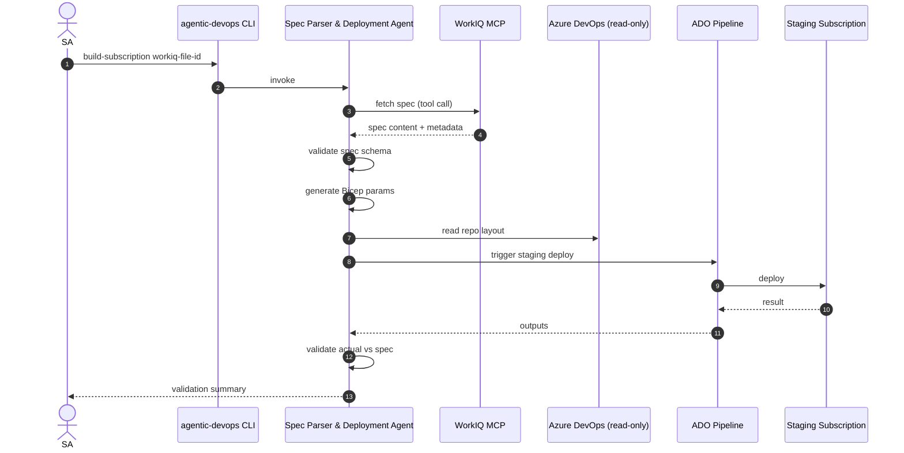

# Sprint 2 — UC1 Spec Parser & Deployment Agent (WorkIQ MCP Happy Path)

| Field | Value |
|-------|-------|
| **Version** | 2.0.0 |
| **Date** | 2026-05-18 |
| **Author** | Urs Rüegg |
| **Status** | Draft |
| **Previous Version** | 1.0.0 (JSON-spec happy path with Python `agents/spec_parser/`, Pydantic spec validator, Jinja2 Bicep param generator, ADO MCP read-only, `pytest` eval harness, Cosmos persistence); 1.1.0 re-scoped to WorkIQ MCP per SPRINT_PLAN §9 Q2; 2.0.0 reframes the sprint around the **GitHub Copilot coding agent runtime** per [ADR-0002](../docs/adr/0002-runtime-is-github-copilot-coding-agent.md) — there is no Python `tools/` package; the agent is `agents/spec-parser/AGENT.md` calling WorkIQ MCP + ADO MCP + `az` CLI directly; deterministic Bicep generation happens via the Bicep template library in `infra/landing-zone/` with the agent supplying parameters. §3.1 lists per-story reinterpretation; user-story IDs `S2-1..S2-7` are preserved. |

> **Window**: 2026-06-08 → 2026-06-19 (2 weeks)
> **Theme**: First vertical slice of **UC1** — the GitHub Copilot Agent connects
> to **WorkIQ MCP from day one** (per [SPRINT_PLAN.md §9 Q2](./SPRINT_PLAN.md#9-open-questions--resolutions)),
> fetches the spec, generates Bicep parameter files, triggers a staging
> deployment, and produces a validation report. ADO MCP read-only; PR opening
> deferred to Sprint 3.

---

## Table of Contents

1. [Goal & Outcomes](#1-goal--outcomes)
2. [Use Cases Addressed](#2-use-cases-addressed)
3. [Scope](#3-scope)
4. [User Stories & Acceptance Criteria](#4-user-stories--acceptance-criteria)
5. [Deliverables](#5-deliverables)
6. [Dependencies](#6-dependencies)
7. [Risks & Mitigations](#7-risks--mitigations)
8. [Exit Criteria](#8-exit-criteria)
9. [Demo Script](#9-demo-script-m3)
10. [Related Documents](#10-related-documents)

---

## 1. Goal & Outcomes

Prove the **happy path** of UC1 with the production spec source from day one:
an SA points the GitHub Copilot Agent at a WorkIQ-managed spec (SharePoint URL
or WorkIQ file ID), the agent fetches it via the **WorkIQ MCP server**,
generates Bicep parameter files, triggers a staging deployment, and produces a
validation summary comparing the deployed state against the spec.

End-of-sprint capability:

```
agentic-devops build-subscription "<workiq-file-id-or-sharepoint-url>"
```

→ spec fetched through WorkIQ MCP, branch + commits created locally, staging
deployed in `rg-agentic-devops-stg-<short-id>`, validation report printed and
persisted, trace recorded through the provider-agnostic trace interface from
Sprint 1.

> **Note** (per [SPRINT_PLAN.md §9 Q1](./SPRINT_PLAN.md#9-open-questions--resolutions)):
> persistence still goes through the in-memory / local backend until a hosting
> subscription is chosen — the trace API does not change.

---

## 2. Use Cases Addressed

- **UC1 — Initial Azure Subscription Build** (WorkIQ MCP happy path)



---

## 3. Scope

### 3.1 Runtime Amendment (per ADR-0002)

Reinterpretation of in-scope items below:

| Original (1.1.0) | Sprint 2 v2.0.0 equivalent |
|------------------|---------------------------|
| `tools/workiq_mcp.py` (Python tool wrapper) | WorkIQ MCP server listed in `.github/copilot/mcp.json`; the agent calls it directly as an MCP tool. |
| `tools/spec_validator.py` (Pydantic validator) | Spec JSON Schema at `schemas/landing-zone-spec.schema.json`; the agent validates via prompt-driven `jq` / `ajv` MCP call or a tiny inline validator step in the Bicep template. |
| `tools/bicep_param_gen.py` (Jinja2 generator) | Bicep parameter file generation by the agent calling `az bicep` MCP (or shell) against the template library in `infra/landing-zone/`. Determinism enforced by parameter-file diff against the previous run committed under `agents/spec-parser/golden-tasks.md` fixtures. |
| `tools/ado_mcp.py` (Python wrapper) | Azure DevOps MCP server listed in `.github/copilot/mcp.json`; the agent calls it directly. |
| `tools/ado_pipeline_run.py` | ADO MCP `run-pipeline` tool with side-effect ceiling `deploy`; requires `approved-to-apply` comment per [SECURITY.md §7](../docs/SECURITY.md#7-destructive-actions-policy). |
| `tools/azure_state_diff.py` | Azure MCP read tools (`mcp_azure_mcp_group_resource_list` and friends) + agent-side diff; result posted as a structured Markdown table on the draft PR. |
| `agents/spec_parser/` Python package | `agents/spec-parser/AGENT.md` prompt file + `agents/spec-parser/golden-tasks.md` fixtures. |
| `evals/tasks/uc1/*.yaml` (3 golden tasks) | `agents/spec-parser/golden-tasks.md` with 3 fixtures, each with `requirement:` front-matter. |
| Persistence via the “trace interface” | The validation report is the structured table on the agent's draft PR; the PR body is the persistent artefact. Copilot run history is the trace. |
| Sprint 1 `agentic-devops build-subscription` CLI | `.github/ISSUE_TEMPLATE/uc1-build-subscription.yml` opens an issue; the Copilot coding agent picks it up and opens a draft PR. |
| ADR `0006-workiq-mcp-as-spec-source.md` | Retained — still valuable as a record of the WorkIQ MCP choice; does not conflict with ADR-0002. |

User-story IDs `S2-1..S2-7` preserved. Acceptance criteria reinterpreted accordingly; the “FR-* implements” lines on each story remain authoritative.

### In Scope (original v1.1.0 text retained for traceability)
- **WorkIQ MCP integration (primary spec source)**: connect the GitHub Copilot Agent to the WorkIQ MCP server; happy-path read of a single spec by ID/URL.
- Spec contract: documented JSON shape returned by WorkIQ MCP (`schemas/landing-zone-spec.schema.json`). The schema describes the **expected output** of the WorkIQ tool, not a Git-stored format.
- Spec validator tool (`tools/spec_validator.py`) applied to WorkIQ MCP responses.
- Bicep parameter generator (`tools/bicep_param_gen.py`) — Jinja2 templates → `.bicepparam`.
- ADO MCP integration (**read-only**): list repos, read files.
- ADO pipeline trigger tool (`tools/ado_pipeline_run.py`) calling existing IaC pipeline (or a stub pipeline shipped with this sprint).
- Validation tool (`tools/azure_state_diff.py`) — reads RG resources via Azure SDK and diffs against spec.
- Spec Parser & Deployment Agent (`agents/spec_parser/`) using Sprint 1's runtime.
- Sample target Bicep (`infra/landing-zone/`); sample WorkIQ spec record used as a fixture for evals.
- Evals: 3 golden tasks (well-formed WorkIQ spec, missing required field, naming-policy violation).

### Out of Scope
- Excel-to-spec ingestion via WorkIQ (Sprint 3 — if the WorkIQ tool returns raw Excel, the mapping is deferred).
- Opening a PR in ADO (Sprint 3).
- Azure Policy enforcement on staging (Sprint 3).
- Multi-region / multi-subscription specs (later).
- Local JSON / YAML spec ingestion as a primary path — per [SPRINT_PLAN.md §9 Q2](./SPRINT_PLAN.md#9-open-questions--resolutions), WorkIQ MCP is the spec source. A local file fixture is only used for eval reproducibility.

---

## 4. User Stories & Acceptance Criteria

### S2-1 — WorkIQ MCP spec ingestion (happy path)
**As an** SA
**I want** the agent to fetch the spec through the **WorkIQ MCP server** by URL/ID
**so that** the production spec source is the agent's input from day one.

**Acceptance**:
- [ ] `tools/workiq_mcp.py` declares the WorkIQ MCP tool contract (name, input schema `{id|url}`, output schema, side effect = `read`, required permissions).
- [ ] Agent successfully fetches a sample spec from WorkIQ given a URL/ID.
- [ ] Authentication uses the GitHub Copilot Agent's identity (service identity in this sprint; OBO deferred to Sprint 3).
- [ ] No spec content is logged — only metadata + hash.
- [ ] Unit + integration tests cover: happy path, missing file (404), insufficient permissions (403), malformed response.
- [ ] *Implements*: `FR-UC1-001`, `FR-UC1-002`, `FR-PLT-002`.

### S2-2 — Spec schema + validator (applied to WorkIQ response)
**As an** SA
**I want** a strict spec schema with clear validation errors
**so that** I can author specs confidently in WorkIQ.

**Acceptance**:
- [ ] JSON Schema for the landing-zone spec checked into `schemas/` and used to validate the WorkIQ MCP response.
- [ ] Validator rejects missing required fields with a path-pointing error (`/network/vnetCidr`).
- [ ] Validator enforces naming rules (regex per resource type) and required tags.
- [ ] Unit tests cover 5+ malformed spec fixtures.
- [ ] *Implements*: `FR-UC1-003`.

### S2-3 — Bicep parameter generation
**As an** agent
**I want** to deterministically generate `.bicepparam` files from a validated spec
**so that** the IaC pipeline can deploy without manual editing.

**Acceptance**:
- [ ] Generated files build clean with `az bicep build-params`.
- [ ] Generation is deterministic (same spec → byte-identical output).
- [ ] Output organized as `infra/landing-zone/parameters/<env>.bicepparam`.
- [ ] Naming + tagging conventions match `.github/copilot-instructions.md` §8.
- [ ] *Implements*: `FR-UC1-004`, `FR-UC1-005`.

### S2-4 — ADO MCP read-only integration
**As an** agent
**I want** to read repo structure from ADO via MCP
**so that** I can place files in the correct repo path.

**Acceptance**:
- [ ] ADO MCP authenticated via the same service identity used for WorkIQ MCP.
- [ ] Agent lists repos, reads `README.md` from a target repo.
- [ ] Tool side-effect class is `read`; no write paths exposed yet.
- [ ] *Implements*: `FR-UC1-006`, `FR-PLT-002`.

### S2-5 — Staging deployment trigger
**As an** agent
**I want** to trigger a staging deployment pipeline and wait for completion
**so that** validation can run against deployed reality.

**Acceptance**:
- [ ] `ado_pipeline_run` tool starts an ADO pipeline run with parameters, returns run ID.
- [ ] Agent polls until completion (max 30 min, configurable).
- [ ] Tool side-effect class is `deploy`; requires `confirm=True`.
- [ ] On success, RG `rg-agentic-devops-stg-<runId>` contains expected resources.
- [ ] *Implements*: `FR-UC1-007`, `FR-UC1-008`.

### S2-6 — Validation: actual vs spec
**As an** SA
**I want** a structured report of any mismatch between spec and deployed state
**so that** I can decide to proceed, fix the spec, or fail the run.

**Acceptance**:
- [ ] `azure_state_diff` enumerates resources in the staging RG and compares each to the spec.
- [ ] Mismatches reported as a structured list: `{path, expected, actual, severity}`.
- [ ] Report persisted through the trace interface (in-memory / local backend per [SPRINT_PLAN.md §9 Q1](./SPRINT_PLAN.md#9-open-questions--resolutions)); will move to Cosmos DB when the hosting subscription is chosen.
- [ ] Agent's final CLI output shows pass/fail + first 10 mismatches.
- [ ] *Implements*: `FR-UC1-009`, `FR-UC1-010`.

### S2-7 — Evals for UC1 happy path
**Acceptance**:
- [ ] 3 golden tasks in `evals/tasks/uc1/`: happy path (WorkIQ fixture), missing tag, invalid VNET CIDR.
- [ ] Each eval YAML includes a `requirement:` key listing the FR IDs it verifies.
- [ ] CI eval pass rate ≥ 95 % (3/3 expected).
- [ ] *Implements*: `NFR-GOV-006`, `FR-PLT-003`.

---

## 5. Deliverables

| Artifact | Path |
|----------|------|
| Spec schema | `schemas/landing-zone-spec.schema.json` |
| Spec Parser Agent | `agents/spec_parser/` |
| Tools | `tools/workiq_mcp.py`, `tools/spec_validator.py`, `tools/bicep_param_gen.py`, `tools/ado_mcp.py`, `tools/ado_pipeline_run.py`, `tools/azure_state_diff.py` |
| Sample fixture | `evals/fixtures/uc1/workiq-spec-happy-path.json` |
| Target IaC | `infra/landing-zone/` (Bicep templates + sample pipeline) |
| Evals | `evals/tasks/uc1/*.yaml` |
| ADR | `docs/adr/0006-workiq-mcp-as-spec-source.md` |

---

## 6. Dependencies

- Sprint 1 runtime, tool framework, tracing.
- **WorkIQ MCP server reachable** from the agent runtime with a service identity that can read at least one sample spec.
- ADO organization with a project + repo for landing-zone IaC.
- A staging subscription with quota for the sample landing zone (this is operational — the platform itself remains subscription-independent, but UC1 obviously needs a *target* subscription to deploy into).
- Sample landing-zone Bicep templates (either pre-existing or built in this sprint as a thin sample).

---

## 7. Risks & Mitigations

| Risk | Mitigation |
|------|------------|
| WorkIQ MCP shape differs from assumptions (per [§9 Q2](./SPRINT_PLAN.md#9-open-questions--resolutions)) | Pin MCP version; capture observed schema as a fixture; isolate behind `tools/workiq_mcp.py` so changes are one-tool refactors. |
| ADO pipeline doesn't exist yet for landing zone | Ship a thin sample pipeline (`infra/landing-zone/pipelines/deploy.yml`) as part of this sprint. |
| Staging subscription quota blocks deploy | Pre-validate with `what-if`; reserve quota; use small SKUs in samples. |
| Spec ambiguity → flaky validation | Keep spec strict (no optional ambiguous fields); document every field in the schema. |
| ADO MCP write semantics differ from expectations | Stay read-only this sprint; defer write to Sprint 3 with explicit ADR. |

---

## 8. Exit Criteria

- [ ] All user stories done.
- [ ] M3 demo executed.
- [ ] Evals green; coverage ≥ 80 % on changed files.
- [ ] Validation report persisted and replayable from Cosmos DB.

---

## 9. Demo Script (M3)

1. Show the JSON spec (`samples/landing-zone-spec.json`).
2. Run `agentic-devops build-subscription samples/landing-zone-spec.json --confirm`.
3. Show generated `.bicepparam` files (deterministic, lint-clean).
4. Show the ADO pipeline run triggered by the agent — green.
5. Show the staging RG in Azure portal — resources tagged and named per spec.
6. Show the validation report (CLI + Cosmos DB document).
7. Show App Insights end-to-end trace (plan → tools → deploy → diff).

---

## 10. Related Documents

- [sprints/SPRINT_PLAN.md](./SPRINT_PLAN.md)
- [sprints/sprint-03-uc1-end-to-end.md](./sprint-03-uc1-end-to-end.md)
- [docs/SOLUTION_OVERVIEW.md §5.1](../docs/SOLUTION_OVERVIEW.md#51-use-case-1--initial-azure-subscription-build-landing-zone-provisioning)
- [docs/INFRASTRUCTURE.md](../docs/INFRASTRUCTURE.md)
- [docs/AI.md](../docs/AI.md)
