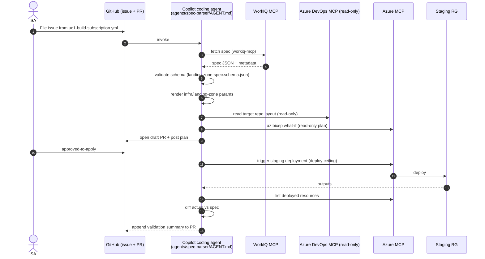

# Sprint 2 — UC1 Spec Parser & Deployment Agent (WorkIQ MCP Happy Path)

| Field | Value |
|-------|-------|
| **Version** | 2.1.0 |
| **Date** | 2026-05-25 |
| **Author** | Urs Rüegg |
| **Status** | Draft |
| **Previous Version** | 1.0.0 (JSON-spec happy path with Python `agents/spec_parser/`, Pydantic validator, Jinja2 Bicep param generator, ADO MCP read-only, `pytest` evals, Cosmos persistence); 1.1.0 re-scoped to WorkIQ MCP per SPRINT_PLAN §9 Q2; 2.0.0 reframed the sprint around the **GitHub Copilot coding agent runtime** per [ADR-0002](../docs/adr/0002-runtime-is-github-copilot-coding-agent.md) via a §3.1 amendment overlay; 2.1.0 MINOR — removes the 1.x retained-for-traceability text and the §3.1 amendment overlay, rewriting §§3–5, 9 in final form. User-story IDs `S2-1..S2-7` preserved with reinterpreted acceptance criteria. |

> **Window**: 2026-06-08 → 2026-06-19 (2 weeks)
> **Theme**: First vertical slice of **UC1** — the GitHub Copilot Agent connects
> to **WorkIQ MCP from day one** (per [SPRINT_PLAN.md §9 Q2](./SPRINT_PLAN.md#9-open-questions--resolutions)),
> fetches the spec, generates Bicep parameter files, triggers a staging
> deployment, and produces a validation report. ADO MCP read-only; PR opening
> deferred to Sprint 3.

---

## Table of Contents

1. [Goal & Outcomes](#1-goal--outcomes)
2. [Use Cases Addressed](#2-use-cases-addressed)
3. [Scope](#3-scope)
4. [User Stories & Acceptance Criteria](#4-user-stories--acceptance-criteria)
5. [Deliverables](#5-deliverables)
6. [Dependencies](#6-dependencies)
7. [Risks & Mitigations](#7-risks--mitigations)
8. [Exit Criteria](#8-exit-criteria)
9. [Demo Script](#9-demo-script-m3)
10. [Related Documents](#10-related-documents)

---

## 1. Goal & Outcomes

Prove the **happy path** of UC1 with the production spec source from day one:
an SA files an issue from `.github/ISSUE_TEMPLATE/uc1-build-subscription.yml`
pointing at a WorkIQ-managed spec (SharePoint URL or WorkIQ file ID). The
GitHub Copilot coding agent picks it up, fetches the spec via the
**WorkIQ MCP server**, validates it, generates `.bicepparam` files against the
`infra/landing-zone/` template library, runs `az bicep what-if` against a
staging RG, posts the plan on the draft PR, and (only after an
`approved-to-apply` comment) triggers the staging deployment via Azure MCP.
The agent appends a validation summary comparing deployed state against the
spec to the same PR.

End-of-sprint capability: an SA opens an issue → the Copilot coding agent
opens a draft PR → posts the deployment plan → the SA replies
`approved-to-apply` → the agent runs the staging deployment and appends the
validation report. No bespoke CLI; no platform Cosmos / App Insights.

---

## 2. Use Cases Addressed

- **UC1 — Initial Azure Subscription Build** (WorkIQ MCP happy path)

---

## 3. Scope

### In Scope
- WorkIQ MCP server entry in `.github/copilot/mcp.json` (added this sprint per [ADR-0006](../docs/adr/0006-workiq-mcp-as-spec-source.md)); spec_parser agent calls it directly as an MCP tool.
- Azure DevOps MCP server entry in `.github/copilot/mcp.json`; **read-only** scope this sprint (list repos, read files).
- Azure MCP server entry in `.github/copilot/mcp.json`; supports `what-if` (read) and `deploy` (gated by `approved-to-apply` per [SECURITY.md §7](../docs/SECURITY.md#7-destructive-actions-policy)).
- `agents/spec-parser/AGENT.md` — Identity, Scope, Tools (WorkIQ MCP, ADO MCP, Azure MCP), Refusal Rules, Output Contract, Confirmation Rules for `deploy`.
- `agents/spec-parser/golden-tasks.md` — 3 fixtures: happy-path (well-formed WorkIQ spec), missing-required-field, naming-policy violation. Each carries `requirement:` front-matter.
- Spec contract: JSON Schema at `schemas/landing-zone-spec.schema.json` describing the WorkIQ MCP output shape.
- `infra/landing-zone/` — sample Bicep template library (UC1 output artefacts). Promotes [ADR-0003 Bicep as IaC](../docs/adr/0003-bicep-as-iac.md) from Proposed to Accepted. Includes a `parameters/` folder where the agent writes `.bicepparam` files.
- `.github/ISSUE_TEMPLATE/uc1-build-subscription.yml` — the trigger.
- `samples/landing-zone-spec.json` — local fixture mirroring the expected WorkIQ shape (used by golden tasks).
- `AGENTS.md` updated: `spec-parser` row with trigger, MCP servers, side-effect ceiling (`deploy`, gated), golden-task path.
- `lychee.toml` + `scripts/preflight.ps1` already cover lint; preflight extended to run `az bicep build` over `infra/landing-zone/**` once it lands.

### Out of Scope
- Excel-to-spec ingestion (Sprint 3 — performed by the WorkIQ MCP server, not by this repo).
- Opening a PR in **ADO** (Sprint 3). This sprint's draft PR is in **GitHub**.
- Azure Policy enforcement on staging (Sprint 3).
- OBO authentication (Sprint 3). This sprint uses a service principal federated to GitHub via WIF.
- Multi-region / multi-subscription specs (later).

---

## 4. User Stories & Acceptance Criteria

### S2-1 — WorkIQ MCP spec ingestion (happy path)
**As an** SA
**I want** the spec-parser agent to fetch the spec through the **WorkIQ MCP server** by URL/ID
**so that** the production spec source is the agent's input from day one.

**Acceptance**:
- [ ] `.github/copilot/mcp.json` includes the WorkIQ MCP server (purpose, required permissions documented; CODEOWNERS-approved).
- [ ] `agents/spec-parser/AGENT.md` declares WorkIQ MCP under Tools with side-effect ceiling `read`.
- [ ] The agent successfully fetches a sample spec from WorkIQ given a URL or file ID supplied in the issue body.
- [ ] Authentication uses a service principal federated to GitHub via WIF (OBO deferred to Sprint 3).
- [ ] No spec content is logged or echoed in PR/issue comments — only metadata + a content hash.
- [ ] Golden-task fixtures cover: happy path, missing file (404), insufficient permissions (403), malformed response.
- [ ] *Implements*: `FR-UC1-001`, `FR-UC1-002`, `FR-PLT-002`.

### S2-2 — Spec schema + validator (applied to WorkIQ response)
**As an** SA
**I want** a strict spec schema with clear validation errors
**so that** I can author specs confidently in WorkIQ.

**Acceptance**:
- [ ] `schemas/landing-zone-spec.schema.json` describes the expected WorkIQ output.
- [ ] Agent Output Contract requires validation against the schema before any Bicep step. Validation errors are posted to the PR as a path-pointing list (`/network/vnetCidr: missing required field`).
- [ ] Schema enforces naming rules (regex per resource type) and required tags (`env`, `owner`, `costCenter`, `workload`).
- [ ] Golden-task fixtures cover 5+ malformed spec shapes (per S2-7).
- [ ] *Implements*: `FR-UC1-003`.

### S2-3 — Bicep parameter generation
**As an** agent
**I want** to deterministically generate `.bicepparam` files from a validated spec
**so that** the IaC pipeline can deploy without manual editing.

**Acceptance**:
- [ ] The agent writes parameter files to `infra/landing-zone/parameters/<env>.bicepparam`.
- [ ] Generated files build clean with `az bicep build-params` (verified locally via `scripts/preflight.ps1`).
- [ ] Generation is deterministic: same spec → byte-identical output (asserted by golden-task fixture diff).
- [ ] Naming + tagging conventions match `.github/copilot-instructions.md` §8.
- [ ] *Implements*: `FR-UC1-004`, `FR-UC1-005`.

### S2-4 — Azure DevOps MCP read-only integration
**As an** agent
**I want** to read repo structure from ADO via MCP
**so that** I can locate the correct repo path for UC1 outputs in Sprint 3.

**Acceptance**:
- [ ] `.github/copilot/mcp.json` includes Azure DevOps MCP with side-effect ceiling `read`.
- [ ] `agents/spec-parser/AGENT.md` declares ADO MCP under Tools (`read` only this sprint).
- [ ] Agent lists repos and reads `README.md` from a target ADO repo during a golden-task replay.
- [ ] Refusal rule: any `write`/`deploy`/`delete` ADO MCP tool call is rejected (write paths land in Sprint 3).
- [ ] *Implements*: `FR-UC1-006`, `FR-PLT-002`.

### S2-5 — Staging deployment trigger
**As an** agent
**I want** to run `az bicep what-if` then trigger a staging deployment after explicit approval
**so that** validation can run against deployed reality.

**Acceptance**:
- [ ] Agent posts the `what-if` output as the plan comment on the draft PR.
- [ ] Deployment via Azure MCP only fires after the magic phrase `approved-to-apply` from a human with write access (per `AGENTS.md` §4).
- [ ] Side-effect ceiling for the deploy tool call is `deploy`; the agent refuses to apply if approver = bot, approver = self, or `what-if` materially differs from the approved plan.
- [ ] On success, the staging RG (`rg-agentic-devops-stg-<short-id>`, customer-owned) contains resources matching the spec.
- [ ] *Implements*: `FR-UC1-007`, `FR-UC1-008`, `NFR-SEC-001`.

### S2-6 — Validation: actual vs spec
**As an** SA
**I want** a structured report of any mismatch between spec and deployed state
**so that** I can decide to proceed, fix the spec, or fail the run.

**Acceptance**:
- [ ] Agent enumerates resources in the staging RG via Azure MCP (read tools) and compares each to the spec.
- [ ] Mismatches are reported as a Markdown table appended to the draft PR: `{path, expected, actual, severity}`.
- [ ] The PR body is the persistent artefact; Copilot run history is the trace (no Cosmos at the platform layer).
- [ ] *Implements*: `FR-UC1-009`, `FR-UC1-010`.

### S2-7 — Golden tasks for UC1 happy path
**Acceptance**:
- [ ] 3 golden-task fixtures in `agents/spec-parser/golden-tasks.md`: happy-path WorkIQ fixture, missing required tag, invalid VNET CIDR.
- [ ] Each fixture has `requirement:` front-matter listing the FR IDs it verifies.
- [ ] Optional `.github/workflows/eval-goldens.yml` replays the fixtures and asserts the PR/comment shape.
- [ ] *Implements*: `NFR-GOV-006`, `FR-PLT-003`.

---

## 5. Deliverables

| Artifact | Path |
|----------|------|
| Spec schema | `schemas/landing-zone-spec.schema.json` |
| Spec Parser prompt | `agents/spec-parser/AGENT.md` |
| Golden tasks | `agents/spec-parser/golden-tasks.md` |
| MCP allow-list updates | `.github/copilot/mcp.json` (add `workiq-mcp`, `azure-devops-mcp`, `azure-mcp`) |
| Agent registry | `AGENTS.md` (spec-parser row) |
| Sample fixture | `samples/landing-zone-spec.json` |
| UC1 target IaC | `infra/landing-zone/` (Bicep template library + sample `parameters/`) |
| Issue template | `.github/ISSUE_TEMPLATE/uc1-build-subscription.yml` |
| ADR | `docs/adr/0006-workiq-mcp-as-spec-source.md` (Accepted); `docs/adr/0003-bicep-as-iac.md` promoted to Accepted |

---

## 6. Dependencies

- [Sprint 1](./sprint-01-orchestrator-mvp.md) complete — orchestrator prompt + MCP allow-list pattern + golden-task framework + plan-then-apply rule.
- **WorkIQ MCP server reachable** from the GitHub Copilot coding-agent runtime with a service principal that can read at least one sample spec.
- An ADO organization with a project + repo to read (write paths land in Sprint 3).
- A customer-owned staging subscription with quota for the sample landing zone (the platform owns no Azure infrastructure; this is the *target* subscription for UC1).

---

## 7. Risks & Mitigations

| Risk | Mitigation |
|------|------------|
| WorkIQ MCP response shape differs from the schema | Pin MCP version in `.github/copilot/mcp.json`; capture observed shape as a fixture in `agents/spec-parser/golden-tasks.md`; schema is the single source of truth. |
| Staging deploy without explicit approval | `approved-to-apply` rule enforced in `agents/spec-parser/AGENT.md` Confirmation Rules; golden-task fixture covers the missing-approval refusal path. |
| Staging subscription quota blocks deploy | Pre-validate with `what-if`; reserve quota; use small SKUs in `samples/landing-zone-spec.json`. |
| Spec ambiguity → flaky validation | Keep schema strict (no optional ambiguous fields); document every field in the schema. |
| Mistaken write to ADO before Sprint 3 | ADO MCP entry in this sprint declares side-effect ceiling `read`; refusal rule in `AGENT.md` blocks any `write` tool call. |

---

## 8. Exit Criteria

- [ ] All user stories done.
- [ ] M3 demo executed.
- [ ] All 3 golden-task fixtures replay green.
- [ ] Validation report appears on the draft PR body for the happy-path golden task.
- [ ] `.github/copilot/mcp.json` updates merged with CODEOWNERS approval.

---

## 9. Demo Script (M3)

1. SA files an issue from `.github/ISSUE_TEMPLATE/uc1-build-subscription.yml` with a WorkIQ spec ID.
2. Copilot coding agent reads `agents/spec-parser/AGENT.md`, calls WorkIQ MCP, validates against `schemas/landing-zone-spec.schema.json`.
3. Agent writes `.bicepparam` files under `infra/landing-zone/parameters/` and runs `az bicep what-if` via Azure MCP.
4. Agent opens a draft PR; PR body shows: spec metadata + hash, generated parameter files (deterministic, lint-clean), `what-if` summary.
5. Reviewer posts `approved-to-apply` on the PR.
6. Agent triggers staging deployment via Azure MCP; on completion, enumerates deployed resources and appends a `{path, expected, actual, severity}` validation table to the PR.

---

## 10. Related Documents

- [sprints/SPRINT_PLAN.md](./SPRINT_PLAN.md)
- [sprints/sprint-03-uc1-end-to-end.md](./sprint-03-uc1-end-to-end.md)
- [docs/SOLUTION_OVERVIEW.md §5.1](../docs/SOLUTION_OVERVIEW.md#51-use-case-1--initial-azure-subscription-build-landing-zone-provisioning)
- [docs/INFRASTRUCTURE.md](../docs/INFRASTRUCTURE.md)
- [docs/AI.md](../docs/AI.md)
