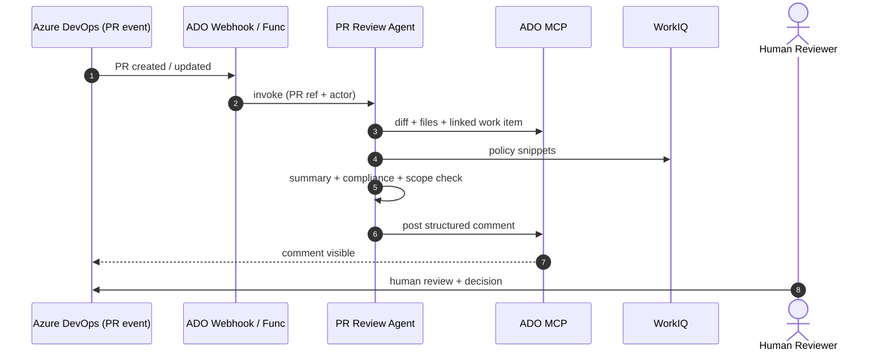

# Sprint 4 — UC3 PR Review Agent

| Field | Value |
|-------|-------|
| **Version** | 1.1.0 |
| **Date** | 2026-05-18 |
| **Author** | Urs Rüegg |
| **Status** | Draft |
| **Previous Version** | 1.0.0 (initial release); 1.1.0 added S4-7 configurable trigger filter per SPRINT_PLAN §9 Q5 |

> **Window**: 2026-07-06 → 2026-07-17 (2 weeks)
> **Theme**: Implement **UC3** — an event-driven PR Review Agent that summarizes
> changes, checks compliance, validates work-item scope, and posts a structured
> review comment. Operates with a non-OBO service identity and **cannot merge**.

---

## Table of Contents

1. [Goal & Outcomes](#1-goal--outcomes)
2. [Use Cases Addressed](#2-use-cases-addressed)
3. [Scope](#3-scope)
4. [User Stories & Acceptance Criteria](#4-user-stories--acceptance-criteria)
5. [Deliverables](#5-deliverables)
6. [Dependencies](#6-dependencies)
7. [Risks & Mitigations](#7-risks--mitigations)
8. [Exit Criteria](#8-exit-criteria)
9. [Demo Script](#9-demo-script)
10. [Related Documents](#10-related-documents)

---

## 1. Goal & Outcomes

When a developer opens or updates a PR in ADO, the **PR Review Agent**
automatically:

1. Fetches the diff, file list, and the linked ADO Boards work item.
2. Pulls relevant enterprise-policy snippets from WorkIQ.
3. Produces a plain-language summary, compliance assessment, and work-item
   scope check.
4. Posts one structured comment on the PR — **never** merges.

Median end-to-end latency target: **< 60 s p95** from PR-event to comment.

---

## 2. Use Cases Addressed

- **UC3 — Pull Request Reviews and Compliance**

---

## 3. Scope

### In Scope
- Event ingestion: ADO Service Hook (PR created/updated) → Azure Function (HTTP trigger).
- Function authenticates the webhook (shared-secret + IP allowlist) and enqueues a job to the agent.
- PR Review Agent (`agents/pr_review/`) reads diff, files, linked work item.
- WorkIQ tool reused from Sprint 3 to fetch policy snippets from a known SharePoint folder.
- Comment composer producing a Markdown structured comment with sections: Summary, Compliance, Scope vs. Work Item, Risks/Questions.
- Idempotency: re-running on the same PR updates the existing agent comment rather than spamming.
- Non-OBO service-agent identity with **comment-only** ADO scopes (no push, no merge).
- Configurable scope filter (which paths trigger the agent, e.g., `infra/**` only or `**`) — shipped as a first-class story (S4-7) per [SPRINT_PLAN.md §9 Q5](./SPRINT_PLAN.md#9-open-questions--resolutions).
- Evals: 5 golden PR fixtures covering diverse change types.

### Out of Scope
- Auto-fix / auto-suggest commits (later).
- Code-quality static analysis (delegated to existing tools).
- Merging or approving PRs.
- Cross-repo / cross-org reviews (later).

---

## 4. User Stories & Acceptance Criteria

### S4-1 — ADO webhook ingestion
**As a** platform engineer
**I want** ADO PR events to invoke the agent reliably
**so that** every PR gets reviewed.

**Acceptance**:
- [ ] Azure Function (Flex Consumption) deployed in `dev`, accepts ADO Service Hook payloads.
- [ ] Webhook auth: shared secret in Key Vault + ADO IP range allowlist.
- [ ] Function de-duplicates events by `pullRequestId + eventType`.
- [ ] Function enqueues a job (Service Bus or direct invoke) → agent runs asynchronously.

### S4-2 — Diff + work-item context
**As an** agent
**I want** the PR diff, file list, and linked work item
**so that** I can reason about the change accurately.

**Acceptance**:
- [ ] ADO MCP fetches PR diff (unified format), file list, PR description, linked work item(s).
- [ ] Work-item title + acceptance criteria included in agent context.
- [ ] Truncation: diffs larger than N KB summarized per-file with an overflow note.

### S4-3 — Compliance + scope analysis
**As a** reviewer
**I want** the agent to verify the change follows enterprise standards and stays within work-item scope
**so that** I can focus on the meaningful parts of the review.

**Acceptance**:
- [ ] Compliance checks: required tags present, no public IPs, allowed locations, no secrets in diff.
- [ ] Scope check: agent flags files outside the work-item's stated scope with explicit examples.
- [ ] Output is a structured object (Pydantic model) before being rendered to Markdown.

### S4-4 — Structured PR comment
**As a** reviewer
**I want** one consistent comment format on every PR
**so that** I can quickly assess agent findings.

**Acceptance**:
- [ ] Comment template with sections: **Summary**, **Compliance** (pass/fail table), **Scope vs. Work Item**, **Risks & Questions**, **Trace** (App Insights link).
- [ ] Comment prefixed with `<!-- agentic-devops:pr-review -->` for idempotent updates.
- [ ] Subsequent runs **update** the same comment (single source of truth per PR).

### S4-5 — Service-agent identity & scope
**As a** security reviewer
**I want** the PR Review Agent to operate with the narrowest possible ADO scope
**so that** the blast radius of a compromise is minimal.

**Acceptance**:
- [ ] Entra Agent ID `agentic-devops-pr-reviewer-<env>` with ADO scopes: `Code (Read)`, `Pull Request Threads (Read & Write)`, `Work Items (Read)`. **No merge, no push.**
- [ ] Conditional Access policy: agent identity restricted to expected outbound IPs.
- [ ] Negative test: attempt to push a commit returns 403.

### S4-6 — Latency target
**Acceptance**:
- [ ] p95 end-to-end latency < 60 s measured on a 50-PR test set in `dev`.
- [ ] Latency tracked as an App Insights metric `pr_review.latency_ms`.

### S4-7 — Configurable trigger filter (path-based)
**As a** repo maintainer
**I want** to choose whether the PR Review Agent runs on every PR or only on PRs touching specific paths (e.g., `infra/**`)
**so that** the agent's scope matches what each pilot team actually wants reviewed.

**Decision context**: per [SPRINT_PLAN.md §9 Q5](./SPRINT_PLAN.md#9-open-questions--resolutions),
the final default is **discovered with the customer**. Sprint 4 ships both
modes so the conversation can happen with real data.

**Acceptance**:
- [ ] Per-repo config file `.agentic-devops/pr-review.yaml` declares `triggerMode: all | paths` and (for `paths`) a list of glob patterns.
- [ ] When `triggerMode: paths` is active and no file in the PR matches, the agent records a `skipped` trace event and posts no comment.
- [ ] Default when no config file is present: `triggerMode: all` (current pilot behaviour).
- [ ] Runbook documents both modes and the decision criteria for choosing between them.
- [ ] Eval includes a fixture PR that should be skipped under `paths: ['infra/**']` and reviewed under `triggerMode: all`.
- [ ] *Implements*: `FR-UC3-009`, `NFR-GOV-004`.

### S4-8 — Evals
**Acceptance**:
- [ ] 5 fixture PRs covering: clean policy-compliant, missing tag, out-of-scope file, secret in diff (negative — agent should flag, not redact), work-item-less PR.
- [ ] Each eval YAML includes a `requirement:` key listing the FR IDs it verifies.
- [ ] Eval pass rate ≥ 95 %.
- [ ] *Implements*: `NFR-GOV-006`, `FR-PLT-003`.

---

## 5. Deliverables

| Artifact | Path |
|----------|------|
| Webhook function | `api/pr_webhook/` (Azure Functions, Python) |
| PR Review Agent | `agents/pr_review/` |
| Tools | `tools/ado_pr_read.py`, `tools/ado_pr_comment.py`, `tools/work_item_fetch.py`, `tools/policy_fetch_workiq.py` |
| Function infra | `infra/modules/function.bicep`, `infra/modules/servicebus.bicep` |
| Comment template | `agents/pr_review/templates/comment.md.j2` |
| Evals | `evals/tasks/uc3/*.yaml` + fixtures `evals/fixtures/prs/*` |
| Runbook | `docs/runbooks/uc3-pr-review.md` |

---

## 6. Dependencies

- Sprint 3 complete: ADO write paths and WorkIQ already proven.
- An ADO project with at least one PR in flight to test against (UC1 PRs from Sprint 3 are ideal fixtures).
- Service Bus (cheap tier) provisioned in `dev` infra.

---

## 7. Risks & Mitigations

| Risk | Mitigation |
|------|------------|
| Webhook replay / duplicate events | Dedupe key on `pullRequestId + sourceRefName + revisionId`. |
| Large diffs blow context window | Per-file summarization with explicit truncation notice. |
| False positives erode trust | Threshold for compliance flags; "advisory only" labeling on borderline findings; weekly eval review. |
| Agent leaks secret-like strings into comment | Redact tokens via deterministic regex pass **before** comment is posted; eval has a negative test. |

---

## 8. Exit Criteria

- [ ] All user stories done.
- [ ] M5 demo executed.
- [ ] Eval pass rate ≥ 95 %.
- [ ] p95 latency < 60 s validated.
- [ ] Agent identity scoped to comment-only (confirmed by negative test).

---

## 9. Demo Script (M5)

1. Open a Sprint-3 UC1 PR in ADO with intentionally introduced issues (one missing tag, one out-of-scope file).
2. Within 60 seconds, the agent comment appears.
3. Inspect comment: summary correct, compliance flags missing tag, scope check flags out-of-scope file with file paths, trace link works.
4. Push an update fixing the tag → comment **updates in place** (no duplicate).
5. Show App Insights latency metric and Cosmos DB trace.
6. Try to push as the agent identity → 403 (separation of duties enforced).

---

## 10. Related Documents

- [sprints/SPRINT_PLAN.md](./SPRINT_PLAN.md)
- [sprints/sprint-03-uc1-end-to-end.md](./sprint-03-uc1-end-to-end.md)
- [docs/SOLUTION_OVERVIEW.md §5.3](../docs/SOLUTION_OVERVIEW.md#53-use-case-3--pull-request-reviews-and-compliance)
- [docs/SECURITY.md](../docs/SECURITY.md)
- [docs/AI.md](../docs/AI.md)
