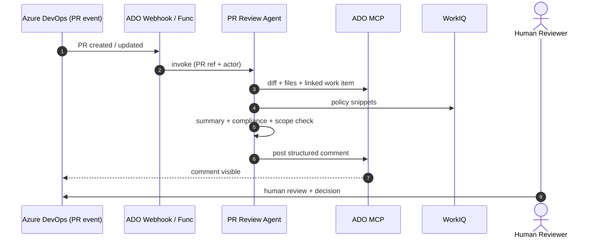

# Sprint 4 — UC3 PR Review Agent

| Field | Value |
|-------|-------|
| **Version** | 2.1.0 |
| **Date** | 2026-05-25 |
| **Author** | Urs Rüegg |
| **Status** | Draft |
| **Previous Version** | 1.0.0 (Azure Functions HTTP-trigger webhook, Service Bus enqueue, Python `agents/pr_review/`, `tools/ado_pr_read.py`, `tools/ado_pr_comment.py`, `tools/work_item_fetch.py`, `tools/policy_fetch_workiq.py`, Pydantic models, App Insights latency metric `pr_review.latency_ms`); 1.1.0 added S4-7 configurable trigger filter per SPRINT_PLAN §9 Q5; 2.0.0 reframed the sprint around the **GitHub Copilot coding agent runtime** per [ADR-0002](../docs/adr/0002-runtime-is-github-copilot-coding-agent.md) via a §3.1 amendment overlay; 2.1.0 MINOR — removes the 1.x retained-for-traceability text and the §3.1 amendment overlay, rewriting §§3–5, 9 in final form. User-story IDs `S4-1..S4-8` preserved with reinterpreted acceptance criteria. |

> **Window**: 2026-07-06 → 2026-07-17 (2 weeks)
> **Theme**: Implement **UC3** — an event-driven PR Review Agent that summarizes
> changes, checks compliance, validates work-item scope, and posts a structured
> review comment. Operates with a non-OBO service identity and **cannot merge**.

---

## Table of Contents

1. [Goal & Outcomes](#1-goal--outcomes)
2. [Use Cases Addressed](#2-use-cases-addressed)
3. [Scope](#3-scope)
4. [User Stories & Acceptance Criteria](#4-user-stories--acceptance-criteria)
5. [Deliverables](#5-deliverables)
6. [Dependencies](#6-dependencies)
7. [Risks & Mitigations](#7-risks--mitigations)
8. [Exit Criteria](#8-exit-criteria)
9. [Demo Script](#9-demo-script-m5)
10. [Related Documents](#10-related-documents)

---

## 1. Goal & Outcomes

When a developer opens or updates a PR in ADO, the **PR Review Agent**
automatically:

1. Fetches the diff, file list, and the linked ADO Boards work item.
2. Pulls relevant enterprise-policy snippets from WorkIQ.
3. Produces a plain-language summary, compliance assessment, and work-item
   scope check.
4. Posts one structured comment on the PR — **never** merges.

Median end-to-end latency target: **< 60 s p95** from PR-event to comment.

---

## 2. Use Cases Addressed

- **UC3 — Pull Request Reviews and Compliance**

---

## 3. Scope

### In Scope
- `agents/pr-review/AGENT.md` — Identity, Scope, Tools (Azure DevOps MCP `pr_get_diff`, `pr_add_comment`, `work_item_get`; WorkIQ MCP policy fetch), Refusal Rules (no merge, no push), Output Contract (Markdown comment template), Confirmation Rules.
- `.github/workflows/uc3-webhook-receiver.yml` — a `repository_dispatch`-triggered GitHub Actions workflow that:
  - Receives the ADO Service Hook payload (or a `repository_dispatch` event proxied from ADO).
  - Validates HMAC + IP allowlist (secret in GitHub Actions secrets).
  - De-duplicates by `pullRequestId + revisionId`.
  - Files an issue from `.github/ISSUE_TEMPLATE/uc3-pr-review.yml`.
- The Copilot coding agent picks up the issue and writes the structured PR comment back to ADO via Azure DevOps MCP.
- Markdown comment template at `agents/pr-review/templates/comment.md` (placeholders filled by the agent's Output Contract; idempotency marker `<!-- agentic-devops:pr-review -->` preserved so re-runs update in place).
- ADO MCP service-principal configuration in `.github/copilot/mcp.json`: scopes `Code (Read)`, `PR Threads (R/W)`, `Work Items (Read)`; **no push, no merge**.
- `agents/pr-review/golden-tasks.md` — 5 fixtures: clean policy-compliant PR, missing tag, out-of-scope file, secret in diff (agent should flag, not redact), work-item-less PR. Sample diffs under `samples/prs/`.
- Per-repo config `samples/azuredevops/.agentic-devops/pr-review.yaml` declaring `triggerMode: all | paths` and (for `paths`) a list of glob patterns — committed to the customer's ADO Repo as a UC1 output asset; the agent reads it via Azure DevOps MCP.
- Latency captured by the workflow (from `repository_dispatch` start to the agent's comment timestamp) and recorded in the issue body. Weekly summary posted via a follow-up Action to a dashboard issue.
- `AGENTS.md` updated: `pr-review` row with trigger, MCP servers, side-effect ceiling (`write`, ADO comments only), golden-task path.

### Out of Scope
- Auto-fix / auto-suggest commits (later).
- Static-analysis code quality (delegated to existing tools).
- Merging or approving PRs.
- Cross-repo / cross-org reviews (later).
- Any platform Azure Function / Service Bus / App Insights wiring — per [ADR-0002](../docs/adr/0002-runtime-is-github-copilot-coding-agent.md) the platform owns no Azure infrastructure.

---

## 4. User Stories & Acceptance Criteria

### S4-1 — ADO PR event ingestion via `repository_dispatch`
**As a** platform engineer
**I want** ADO PR events to reliably trigger the agent without any platform Azure infra
**so that** every PR gets reviewed via GitHub-native plumbing.

**Acceptance**:
- [ ] `.github/workflows/uc3-webhook-receiver.yml` accepts a `repository_dispatch` event payload (ADO Service Hook can be wired directly or via a thin proxy in the customer's environment).
- [ ] Workflow validates HMAC signature against a secret in GitHub Actions secrets; rejects unsigned / bad-signature payloads with 401-equivalent log + no issue creation.
- [ ] Workflow validates source IP against an allow-list (ADO Service Hook ranges).
- [ ] Workflow de-duplicates by `pullRequestId + revisionId` (idempotency key recorded as a label on the created issue).
- [ ] On success, the workflow files an issue from `.github/ISSUE_TEMPLATE/uc3-pr-review.yml`; the Copilot coding agent picks it up.
- [ ] *Implements*: `FR-UC3-001`, `NFR-SEC-004`.

### S4-2 — Diff + work-item context
**As an** agent
**I want** the PR diff, file list, and linked work item via Azure DevOps MCP
**so that** I can reason about the change accurately.

**Acceptance**:
- [ ] `agents/pr-review/AGENT.md` declares Azure DevOps MCP tools `pr_get_diff`, `pr_get_files`, `work_item_get` under Tools with side-effect ceiling `read`.
- [ ] Agent fetches PR diff (unified format), file list, PR description, and linked work item(s).
- [ ] Work-item title + acceptance criteria are included in the agent's context window.
- [ ] Truncation: diffs larger than N KB are summarised per-file with an explicit overflow note rendered in the comment template.
- [ ] *Implements*: `FR-UC3-002`, `FR-UC3-003`.

### S4-3 — Compliance + scope analysis
**As a** reviewer
**I want** the agent to verify the change follows enterprise standards and stays within work-item scope
**so that** I can focus on the meaningful parts of the review.

**Acceptance**:
- [ ] Compliance checks: required tags present, no public IPs, allowed locations, no secrets in diff. Rules sourced from WorkIQ MCP via the policy-fetch tool.
- [ ] Scope check: agent flags files outside the work-item's stated scope with explicit examples.
- [ ] Output is a structured Markdown table rendered via the comment template (deterministic shape — golden tasks assert on it).
- [ ] *Implements*: `FR-UC3-004`, `FR-UC3-005`.

### S4-4 — Structured PR comment (idempotent)
**As a** reviewer
**I want** one consistent comment format on every PR, updated in place on re-runs
**so that** I can quickly assess agent findings.

**Acceptance**:
- [ ] Comment template `agents/pr-review/templates/comment.md` defines sections: **Summary**, **Compliance** (pass/fail table), **Scope vs. Work Item**, **Risks & Questions**, **Run** (link back to the GitHub issue / Copilot run).
- [ ] Comment prefixed with `<!-- agentic-devops:pr-review -->` for idempotent updates.
- [ ] Subsequent runs on the same PR call ADO MCP `pr_update_comment` rather than `pr_add_comment` — verified by golden-task fixture.
- [ ] *Implements*: `FR-UC3-006`.

### S4-5 — Service-principal scope (no merge, no push)
**As a** security reviewer
**I want** the PR Review Agent to operate with the narrowest possible ADO scope
**so that** the blast radius of a compromise is minimal.

**Acceptance**:
- [ ] `.github/copilot/mcp.json` `azure-devops-mcp` configuration for `pr-review` lists scopes: `Code (Read)`, `PR Threads (R/W)`, `Work Items (Read)`. **No push, no merge.**
- [ ] `agents/pr-review/AGENT.md` Refusal Rules forbid any push, merge, branch-delete, or write to work items.
- [ ] Negative-path golden task: agent receives an instruction to push a commit, refuses, and records the refusal in the comment.
- [ ] *Implements*: `NFR-SEC-001`, `NFR-SEC-002`.

### S4-6 — Latency target
**Acceptance**:
- [ ] p95 end-to-end latency < 60 s measured on a 50-PR test set in `dev` (measured from `repository_dispatch` start to the ADO comment timestamp).
- [ ] Latency captured in the GitHub issue body when the agent finishes; weekly aggregation Action posts a summary issue with p50/p95/p99.
- [ ] *Implements*: `NFR-PERF-001`.

### S4-7 — Configurable trigger filter (path-based)
**As a** repo maintainer
**I want** to choose whether the PR Review Agent runs on every PR or only on PRs touching specific paths (e.g., `infra/**`)
**so that** the agent's scope matches what each pilot team actually wants reviewed.

**Decision context**: per [SPRINT_PLAN.md §9 Q5](./SPRINT_PLAN.md#9-open-questions--resolutions),
the final default is **discovered with the customer**. Sprint 4 ships both
modes so the conversation can happen with real data.

**Acceptance**:
- [ ] Per-repo config file `.agentic-devops/pr-review.yaml` (template at `samples/azuredevops/.agentic-devops/pr-review.yaml`) declares `triggerMode: all | paths` and (for `paths`) a list of glob patterns.
- [ ] When `triggerMode: paths` is active and no file in the PR matches, the agent posts no comment and records a `skipped: <reason>` line in the GitHub issue body.
- [ ] Default when no config file is present: `triggerMode: all` (current pilot behaviour).
- [ ] Runbook documents both modes and the decision criteria for choosing between them.
- [ ] Golden-task fixture covers both: a fixture PR skipped under `paths: ['infra/**']` and reviewed under `triggerMode: all`.
- [ ] *Implements*: `FR-UC3-009`, `NFR-GOV-004`.

### S4-8 — Golden tasks
**Acceptance**:
- [ ] 5 fixtures in `agents/pr-review/golden-tasks.md` covering: clean policy-compliant PR, missing tag, out-of-scope file, secret in diff (agent should flag, not redact), work-item-less PR.
- [ ] Each fixture has `requirement:` front-matter listing the FR/NFR IDs it verifies.
- [ ] Replay green via `eval-goldens.yml` (or manual replay) — pass rate ≥ 95 %.
- [ ] *Implements*: `NFR-GOV-006`, `FR-PLT-003`.

---

## 5. Deliverables

| Artifact | Path |
|----------|------|
| Webhook receiver workflow | `.github/workflows/uc3-webhook-receiver.yml` |
| Issue template | `.github/ISSUE_TEMPLATE/uc3-pr-review.yml` |
| PR Review prompt | `agents/pr-review/AGENT.md` |
| Comment template | `agents/pr-review/templates/comment.md` |
| Golden tasks | `agents/pr-review/golden-tasks.md` + fixtures under `samples/prs/` |
| MCP allow-list update | `.github/copilot/mcp.json` (scoped `azure-devops-mcp` config for `pr-review`) |
| Agent registry | `AGENTS.md` (pr-review row) |
| Sample customer-side config | `samples/azuredevops/.agentic-devops/pr-review.yaml` |
| Runbook | `docs/runbooks/uc3-pr-review.md` |

---

## 6. Dependencies

- [Sprint 3](./sprint-03-uc1-end-to-end.md) complete — ADO MCP write path proven (UC1's ADO PRs are the first review targets).
- A customer ADO project with at least one PR in flight to test against (UC1 PRs from Sprint 3 are ideal fixtures).
- An ADO Service Hook (or proxy) capable of POSTing to GitHub's `repository_dispatch` endpoint with the configured shared secret.

---

## 7. Risks & Mitigations

| Risk | Mitigation |
|------|------------|
| Webhook replay / duplicate events | Dedupe key on `pullRequestId + revisionId`; the workflow refuses to create a duplicate issue. |
| Large diffs blow the agent's context window | Per-file summarisation with explicit truncation note in the comment template. |
| False positives erode trust | Threshold for compliance flags; "advisory only" labelling on borderline findings; weekly golden-task review. |
| Agent leaks secret-like strings into the ADO comment | Deterministic regex redact pass in the comment template render step **before** the comment is posted; golden-task fixture asserts no token-shaped strings appear in the rendered comment. |
| MCP service principal scope drift | `azure-devops-mcp` config is CODEOWNERS-gated; negative-path golden task asserts push/merge refusal. |

---

## 8. Exit Criteria

- [ ] All user stories done.
- [ ] M5 demo executed.
- [ ] All 5 golden tasks green (pass rate ≥ 95 %).
- [ ] p95 latency < 60 s validated.
- [ ] Negative test: agent identity attempts to push a commit and is rejected by ADO scope.

---

## 9. Demo Script (M5)

1. Open a Sprint-3 UC1 PR in ADO with intentionally introduced issues (one missing tag, one out-of-scope file).
2. ADO Service Hook fires; `.github/workflows/uc3-webhook-receiver.yml` validates the payload and files an issue from `.github/ISSUE_TEMPLATE/uc3-pr-review.yml`.
3. Within 60 seconds, the Copilot coding agent posts the structured ADO PR comment. Inspect: summary correct, compliance table flags the missing tag, scope check flags the out-of-scope file, "Run" link points back to the GitHub issue.
4. Push an update fixing the tag → the agent's next run updates the **same** ADO comment in place (no duplicate).
5. Show the GitHub issue body — latency captured (start-to-comment); weekly aggregation issue updated.
6. Negative test: attempt to push a commit as the agent's ADO identity → 403 (separation of duties enforced).
7. Switch the customer's `.agentic-devops/pr-review.yaml` from `triggerMode: all` to `triggerMode: paths: ['infra/**']` → open a code-only PR → agent posts no comment and records `skipped` in the GitHub issue.

---

## 10. Related Documents

- [sprints/SPRINT_PLAN.md](./SPRINT_PLAN.md)
- [sprints/sprint-03-uc1-end-to-end.md](./sprint-03-uc1-end-to-end.md)
- [docs/SOLUTION_OVERVIEW.md §5.3](../docs/SOLUTION_OVERVIEW.md#53-use-case-3--pull-request-reviews-and-compliance)
- [docs/SECURITY.md](../docs/SECURITY.md)
- [docs/AI.md](../docs/AI.md)
