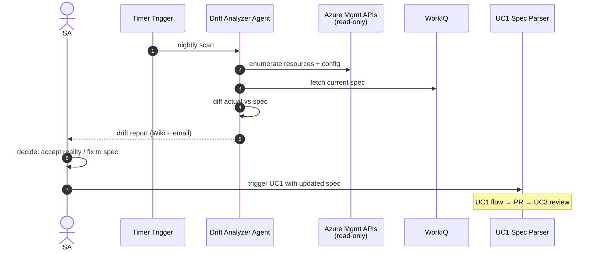

# Sprint 5 — UC2 Drift Analyzer Agent

| Field | Value |
|-------|-------|
| **Version** | 2.0.0 |
| **Date** | 2026-05-18 |
| **Author** | Urs Rüegg |
| **Status** | Draft |
| **Previous Version** | 1.0.0 (initial release with Python `agents/drift_analyzer/`, `tools/azure_scan.py`, `tools/diff_engine.py`, `tools/ado_wiki_upsert.py`, `tools/teams_notify.py`, Azure Function Timer Trigger, Cosmos `drift-reports` + `tracked-subscriptions` containers, `agentic-devops` CLI subcommands); 1.0.1 clarified §6 dependency wording after WorkIQ moved to S2; 2.0.0 reframes the sprint around the **GitHub Copilot coding agent runtime** per [ADR-0002](../docs/adr/0002-runtime-is-github-copilot-coding-agent.md) — the scheduler is `.github/workflows/uc2-nightly.yml` (cron → issue per tracked subscription); the agent is `agents/drift-analyzer/AGENT.md` calling Azure MCP for read-only scans + WorkIQ MCP for the spec + Azure DevOps MCP for the wiki upsert; the tracked-subscription registry is a Markdown file at `samples/tracked-subscriptions.md` (or per-customer ADO Wiki page) rather than Cosmos. §3.1 lists per-story reinterpretation; user-story IDs `S5-1..S5-7` are preserved. |

> **Window**: 2026-07-20 → 2026-07-31 (2 weeks)
> **Theme**: Implement **UC2** — scheduled read-only Azure scans that compare
> live subscription state against the spec UC1 owns, produce a gap report, and
> route remediation back through UC1's deployment flow (and therefore UC3's
> review). Closes the virtuous cycle.

---

## Table of Contents

1. [Goal & Outcomes](#1-goal--outcomes)
2. [Use Cases Addressed](#2-use-cases-addressed)
3. [Scope](#3-scope)
4. [User Stories & Acceptance Criteria](#4-user-stories--acceptance-criteria)
5. [Deliverables](#5-deliverables)
6. [Dependencies](#6-dependencies)
7. [Risks & Mitigations](#7-risks--mitigations)
8. [Exit Criteria](#8-exit-criteria)
9. [Demo Script](#9-demo-script-m6)
10. [Related Documents](#10-related-documents)

---

## 1. Goal & Outcomes

A scheduled (nightly + on-demand) **Drift Analyzer Agent** scans tracked Azure
subscriptions in **read-only** mode, compares them against the latest spec, and
produces a gap report. The SA reviews the report; if a change is approved,
remediation flows through UC1 (regenerate Bicep params, staging deploy, PR
opened, UC3 reviews).

End-of-sprint capability:

```
agentic-devops check-drift --subscription <id>        # on-demand
# plus a nightly Logic App / Function timer trigger
```

→ drift report in Cosmos DB + ADO Wiki page + email/Teams summary to SA.

---

## 2. Use Cases Addressed

- **UC2 — Subscription Updates (Drift & Change Management)**



---

## 3. Scope

### 3.1 Runtime Amendment (per ADR-0002)

Reinterpretation of in-scope items:

| Original (1.0.1) | Sprint 5 v2.0.0 equivalent |
|------------------|---------------------------|
| `agents/drift_analyzer/` Python package | `agents/drift-analyzer/AGENT.md` prompt file + `agents/drift-analyzer/golden-tasks.md` fixtures. |
| `tools/azure_scan.py` | Azure MCP read tools (`mcp_azure_mcp_group_resource_list`, `mcp_azure_mcp_storage_*`, etc.) called by the agent. |
| `tools/diff_engine.py` (Python diff) | Diff computed by the agent against the spec returned by WorkIQ MCP. Severity rules are encoded in `agents/drift-analyzer/AGENT.md`. Stable ordering enforced by output-contract spec (sorted by `resourcePath` then `property`). |
| `tools/ado_wiki_upsert.py` | Azure DevOps MCP `wiki-upsert` tool. |
| `tools/teams_notify.py` | GitHub Actions step posting to Teams via a configured webhook secret. Triggered by the agent posting a `severity:error` label on the issue. |
| `api/drift_timer/` (Azure Function timer) | `.github/workflows/uc2-nightly.yml` — GitHub Actions cron workflow that opens one issue per tracked subscription using `.github/ISSUE_TEMPLATE/uc2-drift-scan.yml`. |
| Cosmos container `drift-reports` with `/subscriptionId` partition + TTL 180d | Drift reports are the issue body + a structured comment thread on the drift-scan issue. Long-term archive is the Git history of the customer's ADO Wiki page `/Drift/<subscriptionId>`. |
| Cosmos container `tracked-subscriptions` partitioned by `/tenantId` | Markdown registry at `samples/tracked-subscriptions.md` (one row per subscription) or, per customer, in their ADO Wiki. CRUD via PRs to that file. |
| `agentic-devops track-subscription add|list|remove` CLI | Issue from `.github/ISSUE_TEMPLATE/uc2-track-subscription.yml`; the agent updates the Markdown registry. |
| Read-only Entra Agent ID `agentic-devops-drift-reader-<env>` | Read-only service principal scoped to `Reader` on each tracked subscription, federated to GitHub via WIF. |
| `evals/tasks/uc2/*.yaml` + fixtures | `agents/drift-analyzer/golden-tasks.md` (4 fixtures: clean, tag-drift, missing-resource, extra-unsanctioned). |
| `docs/runbooks/uc2-drift.md` | Retained — still Markdown. |

User-story IDs `S5-1..S5-7` preserved.

### In Scope (original v1.0.1 text retained for traceability)
- Drift Analyzer Agent (`agents/drift_analyzer/`).
- Read-only Azure scan via `azure-mgmt-resource`, `azure-mgmt-network`, `azure-mgmt-storage`, etc.
- Diff engine that handles resource-level + property-level comparisons with severity tiers (`info | warn | error`).
- Subscription registry (which subscriptions are tracked + which spec is canonical for each).
- Scheduler: Azure Function Timer Trigger (`0 0 2 * * *` UTC).
- On-demand CLI: `agentic-devops check-drift --subscription <id>`.
- Report sinks: Cosmos DB (`drift-reports`), ADO Wiki page (one per subscription), Teams/email summary.
- Read-only Entra Agent ID for the drift agent.
- Evals: 4 fixtures (no drift, tag drift, missing resource, extra unsanctioned resource).

### Out of Scope
- Auto-remediation (intentionally — keep humans in the loop per governance).
- Cross-subscription / management-group rollups (later).
- Non-Azure cloud scans (out of platform scope).

---

## 4. User Stories & Acceptance Criteria

### S5-1 — Subscription registry
**As a** platform owner
**I want** a registry of tracked subscriptions and their canonical specs
**so that** the agent knows what to scan and what to compare against.

**Acceptance**:
- [ ] Registry stored in Cosmos DB container `tracked-subscriptions`, partition `/tenantId`.
- [ ] Entry: `subscriptionId`, `specRef` (WorkIQ link), `owner`, `schedule`, `severityOverrides`.
- [ ] CRUD via CLI: `agentic-devops track-subscription add|list|remove`.

### S5-2 — Read-only Azure scan
**As an** auditor
**I want** the agent to scan all resources and key properties in a subscription
**so that** drift detection is comprehensive.

**Acceptance**:
- [ ] Scan covers: resource groups, VNETs/subnets, NSGs, storage accounts, key vaults, app services, function apps (configurable per resource type).
- [ ] Agent identity has only `Reader` + `Reader and Data Access` where required — confirmed by negative test (write attempts return 403).
- [ ] Scan completes for a 200-resource subscription in < 5 min.

### S5-3 — Diff engine with severities
**Acceptance**:
- [ ] Diff produces a list of `{resourcePath, property, expected, actual, severity}` items.
- [ ] Severity rules: missing required tag = `error`, extra unsanctioned resource = `warn`, drifted SKU on non-prod = `info`.
- [ ] Stable ordering so repeat reports diff cleanly.

### S5-4 — Report sinks
**Acceptance**:
- [ ] Cosmos DB `drift-reports` container; partition `/subscriptionId`; TTL 180 days.
- [ ] ADO Wiki page upserted at `/Drift/<subscriptionId>` with a Markdown table.
- [ ] Teams/email message sent to the subscription owner summarizing counts by severity + link to Wiki.
- [ ] If zero drift, only a single line is logged (no spammy Teams ping).

### S5-5 — Scheduler + on-demand
**Acceptance**:
- [ ] Timer-trigger function runs nightly at 02:00 UTC; missed runs retried up to 3 times.
- [ ] CLI `check-drift` returns immediately for `<id>` already in scan window (no duplicate work).
- [ ] Each scheduled run creates one Cosmos run document; idempotent by `scanDate + subscriptionId`.

### S5-6 — Route remediation through UC1
**As an** SA
**I want** to accept the drift report and trigger UC1 with the latest spec
**so that** changes follow the standard review path.

**Acceptance**:
- [ ] `agentic-devops remediate-drift <reportId>` opens a pre-filled UC1 command with the spec link.
- [ ] No drift-induced changes deploy without going through UC1's staging + PR + UC3 cycle.

### S5-7 — Evals
**Acceptance**:
- [ ] 4 fixture subscriptions: clean, tag-drift, missing-resource, extra-unsanctioned-resource.
- [ ] Eval pass rate ≥ 95 %.

---

## 5. Deliverables

| Artifact | Path |
|----------|------|
| Drift Analyzer Agent | `agents/drift_analyzer/` |
| Tools | `tools/azure_scan.py`, `tools/diff_engine.py`, `tools/ado_wiki_upsert.py`, `tools/teams_notify.py` |
| Scheduler | `api/drift_timer/` (Azure Function timer trigger) |
| Registry | `tools/sub_registry.py`, Cosmos container `tracked-subscriptions` |
| Evals | `evals/tasks/uc2/*.yaml` + fixtures |
| Runbook | `docs/runbooks/uc2-drift.md` |

---

## 6. Dependencies

- Sprint 3 complete (WorkIQ MCP Excel ingestion, OBO, full UC1 deployment flow; WorkIQ MCP itself was introduced in [Sprint 2](./sprint-02-uc1-spec-parser-happy-path.md)).
- Sprint 4 complete (UC3 will review any drift-driven PRs).
- A tracked subscription with a known canonical spec (use the staging subscription from Sprint 2/3 demos).

---

## 7. Risks & Mitigations

| Risk | Mitigation |
|------|------------|
| Read-only scope leaks (agent over-permitted) | Hard-code `Reader` role at provisioning; negative tests on write attempts; quarterly access review. |
| Scan exceeds 5-min function timeout | Use Durable Functions (fan-out) or batched scans per resource type. |
| Noisy reports cause alert fatigue | Severity tiers + only `error` triggers Teams notification; weekly digest for `warn`/`info`. |
| Spec drift ≠ deployed reality (spec is wrong) | Provide explicit `accept-as-spec` flow that updates the spec via UC1 with documented rationale. |

---

## 8. Exit Criteria

- [ ] All user stories done.
- [ ] M6 demo executed.
- [ ] Nightly scan green for 5 consecutive runs.
- [ ] Eval pass rate ≥ 95 %.
- [ ] Negative test: agent identity write attempt returns 403.

---

## 9. Demo Script (M6)

1. Run `agentic-devops track-subscription add --id <stg-sub-id> --spec <sharepoint-url>`.
2. Manually tweak a tag on a storage account in the tracked subscription (introduce drift).
3. Run `agentic-devops check-drift --subscription <stg-sub-id>`.
4. Show: Cosmos drift report, ADO Wiki page updated, Teams message to subscription owner.
5. Run `agentic-devops remediate-drift <reportId>` → UC1 fires, staging deploy + PR opened.
6. UC3 (Sprint 4) reviews the PR automatically — full virtuous cycle visible.
7. Show timer trigger history in Azure Monitor.

---

## 10. Related Documents

- [sprints/SPRINT_PLAN.md](./SPRINT_PLAN.md)
- [sprints/sprint-03-uc1-end-to-end.md](./sprint-03-uc1-end-to-end.md)
- [sprints/sprint-04-uc3-pr-review-agent.md](./sprint-04-uc3-pr-review-agent.md)
- [docs/SOLUTION_OVERVIEW.md §5.2](../docs/SOLUTION_OVERVIEW.md#52-use-case-2--subscription-updates-drift--change-management)
- [docs/DATA.md](../docs/DATA.md)
